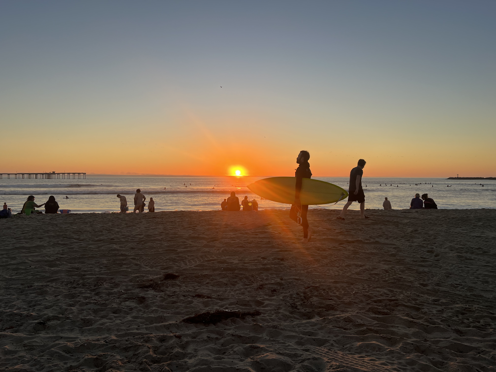
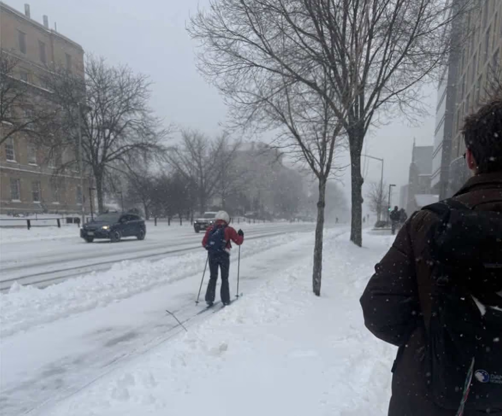
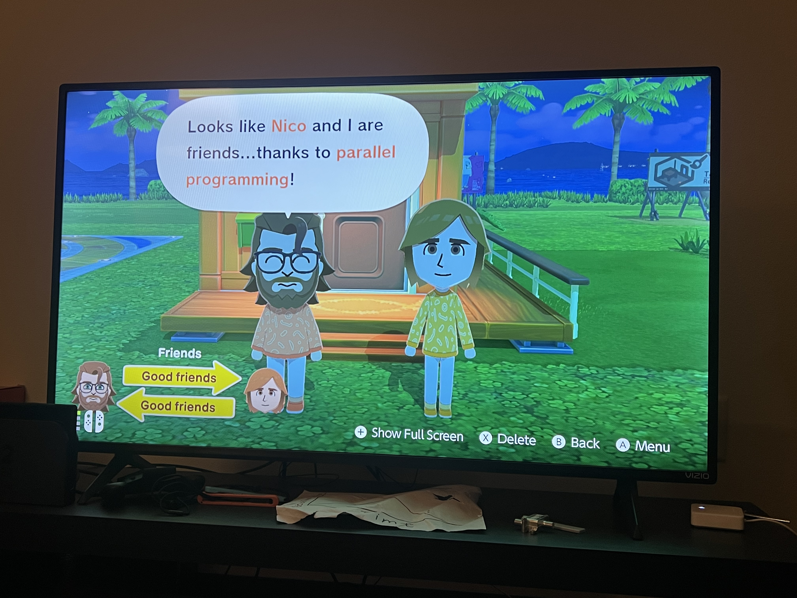
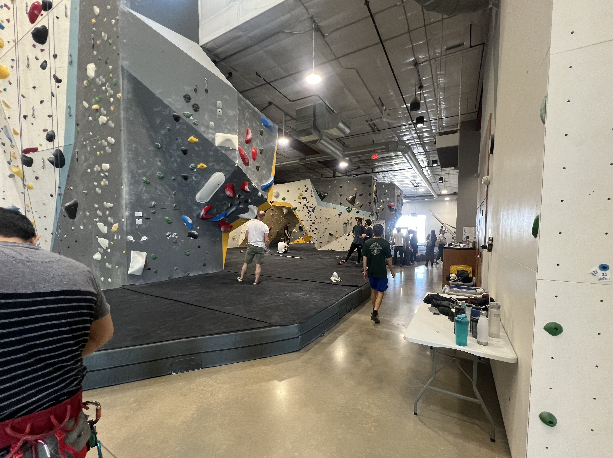

Many adventures have happened recently. I spent my spring break in San Diego with my family. This
was a lot of fun, and the first time we've done it since Covid. We managed to dodge 30 inches of snow.
By sheer chance, I also ran into Cole there (he was at a materials science convention) and we had the
opportunity to catch up.

    <figure>
        
        <figcaption>Here (San Diego, CA)</figcaption>
    </figure>
    <figure>
        
        <figcaption>There (Madison, WI)</figcaption>
    </figure>

Andrew introduced me to <em>Tomodachi Life</em>. As of writing this, I'm level 30 and have introduced Miis
resembling most of my friends (and Hugh Morris) to the island. Andrew also airdropped in his Polish friend Slipper's
Mii — he lives on a secluded island and wears a safety helmet.

<figure>
    
    <figcaption>Ben and me in Tomodachi Life</figcaption>
</figure>

I also finally got a chance to catch up with Jake! He works in North Chicago (and I might work where he
works soon, we'll see). We went climbing with Chris, and it was there that I realized I am woefully out of shape...
height is all I have going for me right now. But I had fun!

<figure>
    
    <figcaption>A climbing gym outside of Madison</figcaption>
</figure>

I feel like my friend group has become more tightly knit over the past few months. We've been
hanging out more often. The end of my last semester at UW–Madison is fast approaching and I'm cognizant that
soon we'll all go flying in different directions, but I'm pretty confident we'll keep what we have. That's all for now! Time to lock in for final exams.
