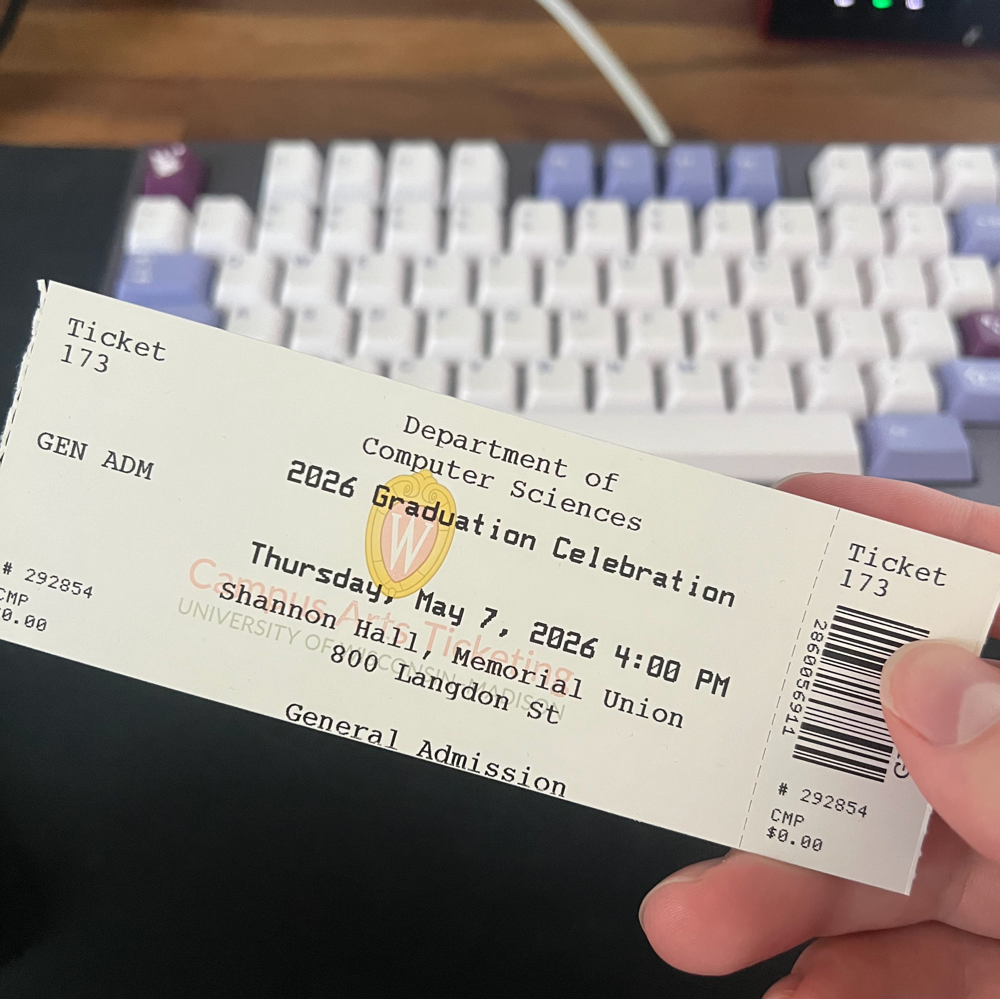
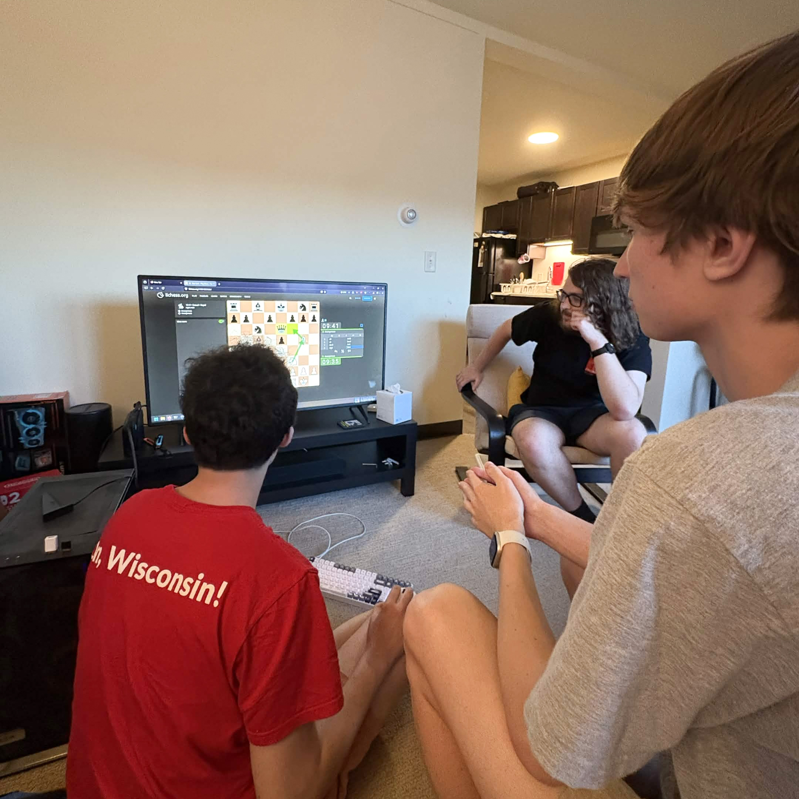
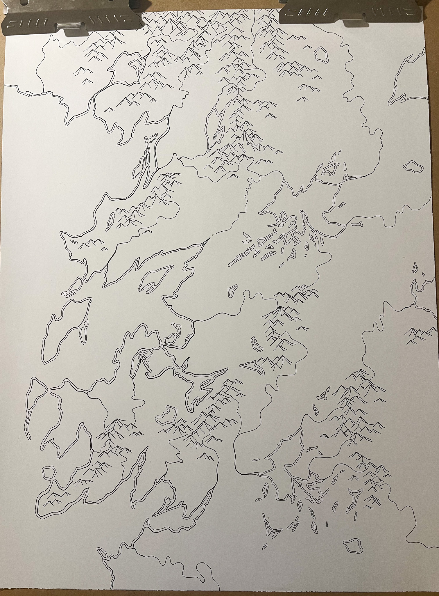

<figure class="float-right">
    
    <figcaption>They made CS graduation fancy this year!</figcaption>
</figure>

Um, I'm officially a college graduate… SO! We're going to pretend everything is fine and that I'm perfectly ready to get my life underway.

My piece of paper is in the mail, certifying that against all odds I actually did receive an education in computer science. I have a SWE job which I know will be fun, I'm picking up an incredibly blue Honda Civic this week (I didn't need a car in Madison), and I have a place to live. So, things are going pretty well. I'm obviously incredibly fortunate to be where I am.

<figure>
    
    <figcaption>Andrew might be a little too interested in Bucky...</figcaption>
</figure>

I will say, however, that I was ready to leave <a href="https://www.wisc.edu/" target="_blank">UW-Madison</a> (at least for the time being). It's not that I didn't enjoy my time there---to the contrary, I couldn't have picked a better school (see <a href="/writing/my-wisconsin-experience/">My Wisconsin Experience</a>)---but four years is four years. Time to try something new.

I miss [my friends](/friends) a lot, though, even though it's only been a few weeks. It feels like only yesterday that we met, and now we've been scattered all over the United States. That part is bittersweet.

Luckily, everyone has a high-quality opportunity to chase after. I plan to visit Madison often in the coming year to stay close to Andrew and Ben who each have one year left.

Until we meet again!... <small>in Discord... later today.</small>
<figure>
    
    <figcaption>Game night with Andrew, Ben, Kot, & Noah... Chess, Jackbox, and lots of snacks :)</figcaption>
</figure>

In other news, as I look forward, I hope to develop new habits and hobbies. I think I'm going to take up climbing, double down on how many <a href="/books" target="_blank">books</a> I'm reading, and begin to draw. For me, drawing has almost always been cartographic (like the map I've been working on below), but I'd like to expand my skillset.

<figure>
    
    <figcaption>Map with markings. Can you spot the dragon?</figcaption>
</figure>

That's a good set of things to work on for now; we'll go from there. Oh, and I'm also going to program a bit, as I can hardly let Claude have *all* the fun. Need to keep growing and all. My ultimate goal is to be able to understand The Art of Computer Programming and build some really cool OSS. Intermediate goals are still in the works. I'm sure I'll have exciting updates in a future /now.

Everything is, in fact, mostly fine.

<figure>
    
    <figcaption>Graduated me... in a pond :)</figcaption>
</figure>

