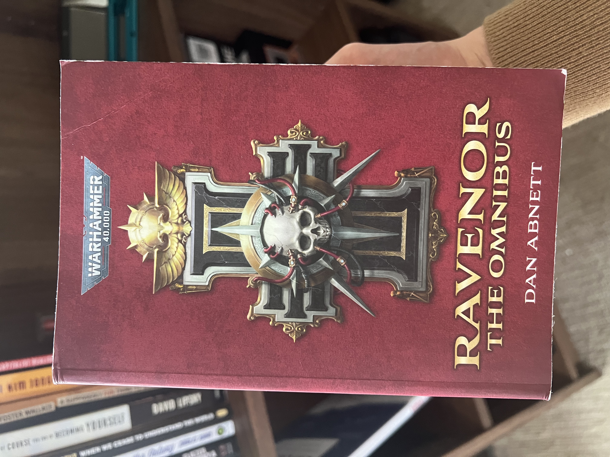
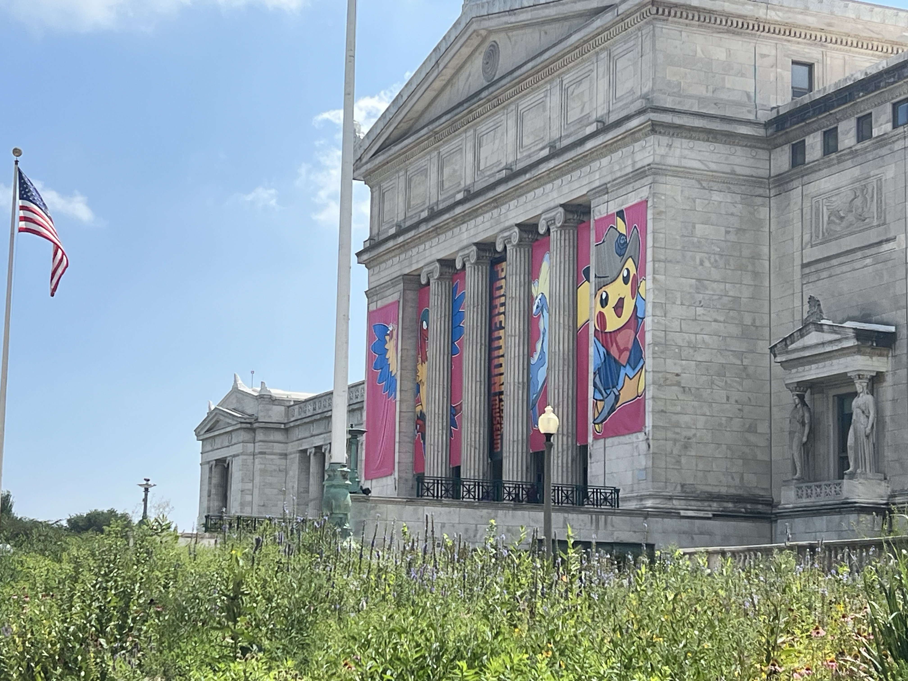
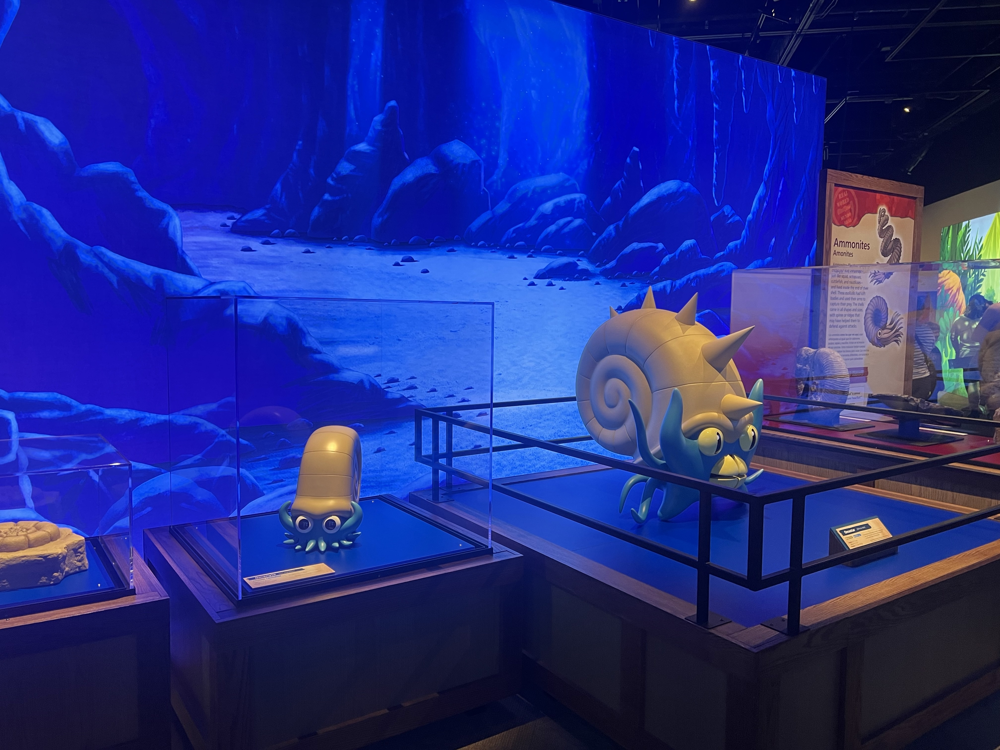
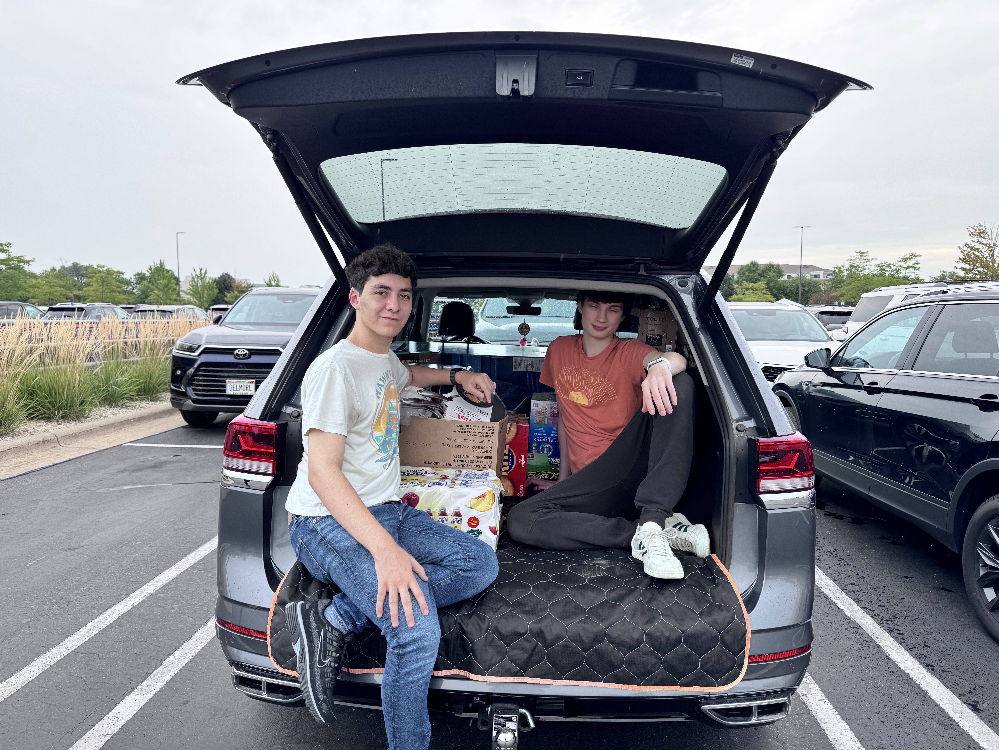

This morning at 6 a.m., I was on the road, driving from Madison to Chicago. It was a purple-pink sunrise, the ground dusted with morning dew, with a thin veneer of white fog sitting over the grassy fields lining the road. There were few cars, except for a steady stream of truckers---and me, in my bright blue Civic. I was driving, so I couldn’t grab a photo. You’ll just have to trust me---it was beautiful. It made me wish I was into photography.

<figure class="float-right">
    
    <figcaption>Ravenor, by Dan Abnett</figcaption>
</figure>

Life seems good. I've been reading through the Ravenor Omnibus, a gritty 850-page Warhammer 40K monolith. I finished its prequel, Eisenhorn, earlier this summer. My quest to read more is making progress, but my quest to code outside of work could use more focus. <a href="https://nlessard.online/">Noah</a> very kindly brought me in on his <a href="https://github.com/noahlessard/memeticTree" target="_blank">Memetic Tree of Life</a> project---I've made a few commits there, and it's really come together.

A few weeks ago, I went to the Field Museum with Jake and a few friends. It was mostly to sate his Pokemon obsession, but it was also nice to walk around and look at the exhibits again. I think the Pokemon exhibit was an underwhelming cash grab, but he thought it was cool, so what the heck. It should come as no surprise that I much preferred the Cats exhibit in 2024.

    <figure>
        
        <figcaption>Field Museum in Chicago</figcaption>
    </figure>
    <figure>
        
        <figcaption>Pokemon exhibit</figcaption>
    </figure>

I spent a weekend helping <a href="https://www.amoses.dev/" target="_blank">Andrew</a> move into his new apartment. I drove far too much, and I never want to haul box after box of IKEA furniture up three flights of stairs again. Though, all in all, it was pretty fun. Nithilan even showed up to help us build!

I enjoyed being back in Madison, though I admit it feels rather weird being there as Not A Student. I have to remind myself that my job is, in fact, *not* an internship. But all of this is okay.

<figure>
    
    <figcaption>Andrew Shopping Trip</figcaption>
</figure>

That's all for now. In September, I hope to finish up a couple books and my [map from May](http://localhost:8080/now/2026-may/), as well as decide on and start a proper project, for real this time. I'll have more to share soon! Toodles.
