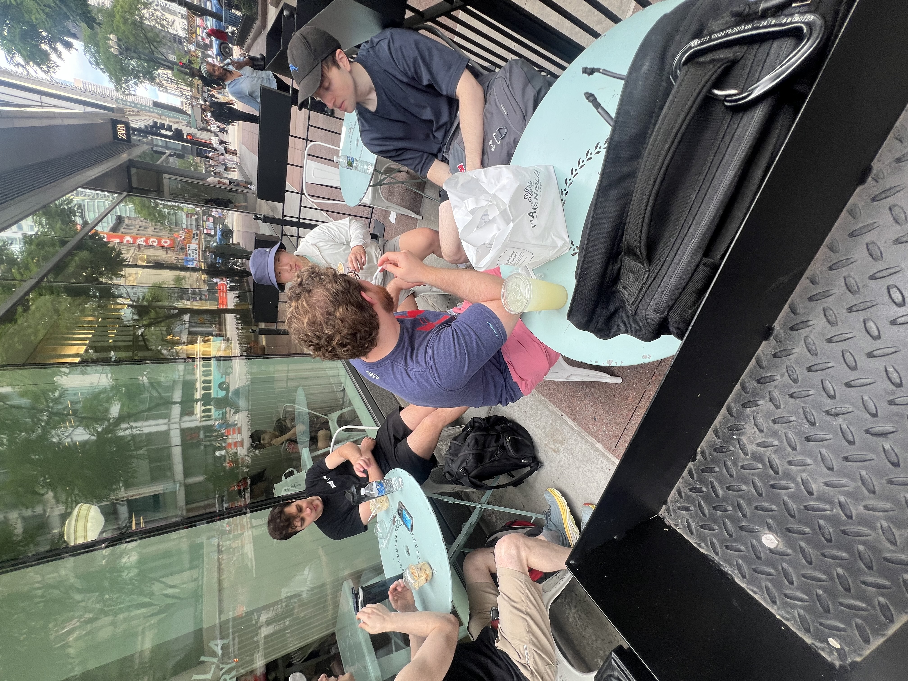
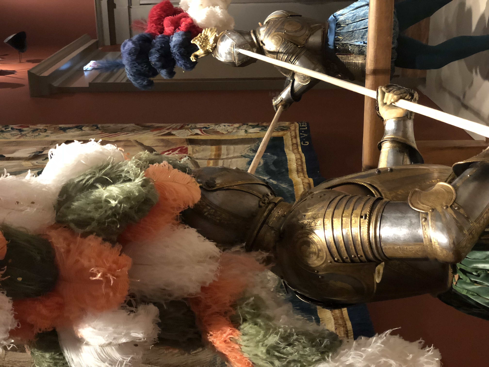
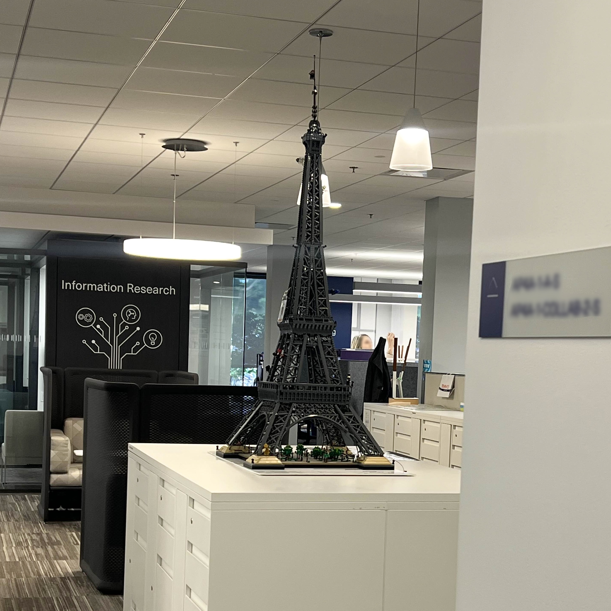

I took the train down to Chicago last weekend with some friends. We hit a climbing gym downtown before visiting the <a href="https://www.artic.edu/" target="_blank">Art Institute of Chicago</a>:

    <figure>
        
        <figcaption>Bakery with friends</figcaption>
    </figure>
    <figure>
        
        <figcaption>Armor!!!</figcaption>
    </figure>

The museum is a special place for me... I went there for a high school art field trip with my mom, so whenever I'm in the city I like to visit, along with the Field museum (that one's just as awesome).

---

I also started **work** (yeah the 'ol 9-to-5, woohoo!). My commute isn't terrible (24 min?) on T/W/Th, and the office itself is nice. There are a bunch of fancy LEGO sets set up on our floor:

<figure>
    
    <figcaption>10,001 piece Eiffel tower LEGO set (5' tall)</figcaption>
</figure>

I have a lot of freedom and I'm settling in well. Most of the challenge has been climbing Domain Knowledge Mountain.

From a work culture perspective things seem solid, and my team has great chemistry. There are 6 of us, plus one more soon. We'll see how things shape up over time but I'm optimistic.

I also spent an hour and a half with my team last week sorting books at a <a href="https://www.berniesbookbank.org/about/" target="_blank">book bank</a>. The organization distributes roughly 300,000 books each year to students across the Chicago area who otherwise wouldn't have books of their own. About 60 of us participated.

A pretty good start!
