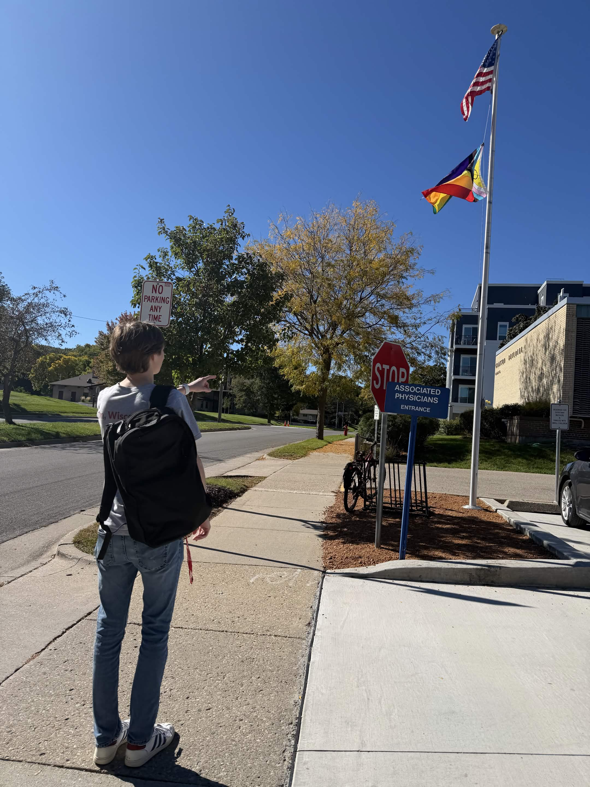
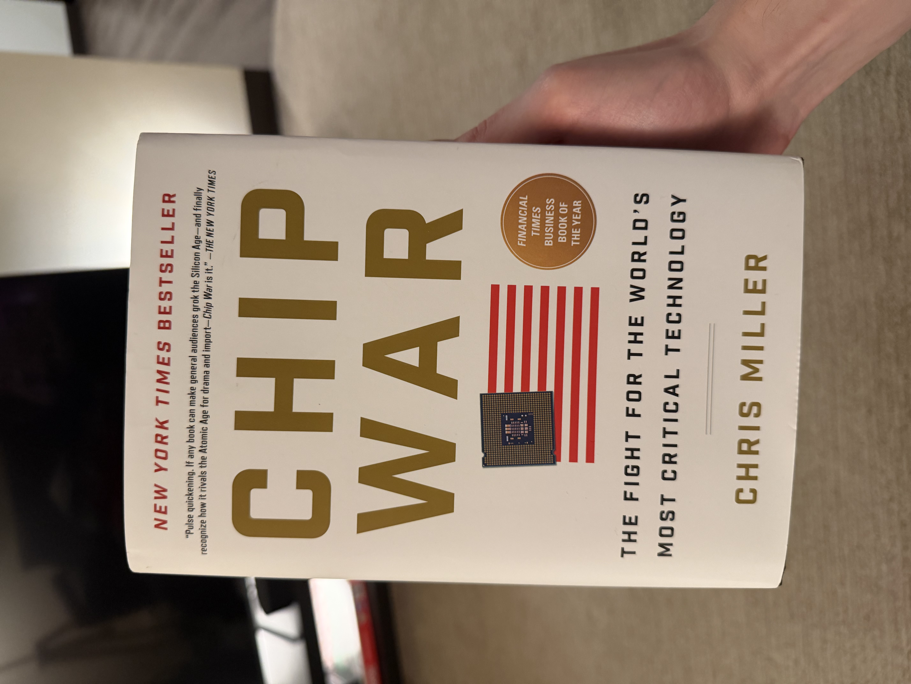
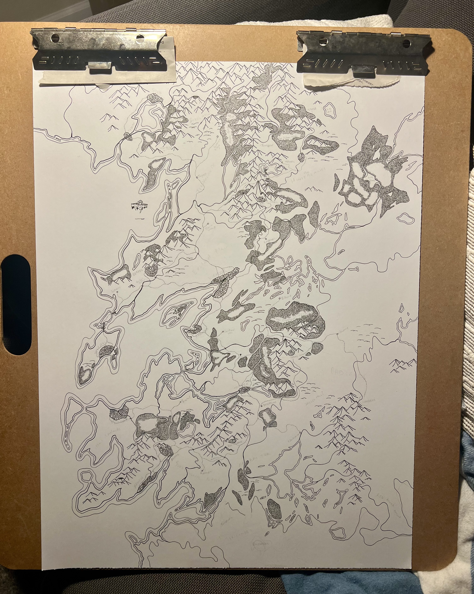

I have a hybrid work schedule, which means I can spend most of my week away from home. This has been really, really nice---I don't know how most people do five days 9-5. (Well I do, but I've been spoiled.) I've spent a lot of this flexibility visiting my friends in Madison, which has the added benefit of separating me from my PC and all the distractions within.

<figure>

<figcaption>Nico in Madison</figcaption>
</figure>

It's been neat working in a role that includes many things that, only a few years ago, I would've associated with a senior engineer---working with business groups to understand requirements, planning the project, architecting a solution, coordinating development, validation, and release, all while also programming the code itself (with AI, of course). It's been nice to be on a team that encourages this sort of agency, and it's been rewarding to see my work release and be used by others.

<figure>

<figcaption style="color: #DC143C; text-decoration: underline;">Sneptember is over!!! (collapses)</figcaption>
</figure>

"Traditional Nico" has always been a big fantasy enjoyer, seasoned by the occasional historical text. More recently, however, I've been reading nonfiction more geared towards tech and economics. I've read <em>Soul of a New Machine</em> and <em>Weaving the Web</em>, and now I'm reading <em>Chip War</em>. Next, I'll probably read something about US financials.

<figure style="max-width: 60%">

<figcaption>Chip War, by Chris Miller (2022)</figcaption>
</figure>

My latest map is coming along swimmingly, with most of the environment complete---I still have ~10,000 trees to pen in for the southernmost forest. I also need to label things, and my handwriting isn't that good, so that part is scary. Finally, I need to make the big decision of whether to watercolor the entire thing. I am leaning 'no' right now, only because of the potential for mishaps, but it would look pretty... We'll see.

<figure>
    
    <figcaption>Hand-drawn Fantasy Map (2026–)</figcaption>
</figure>

