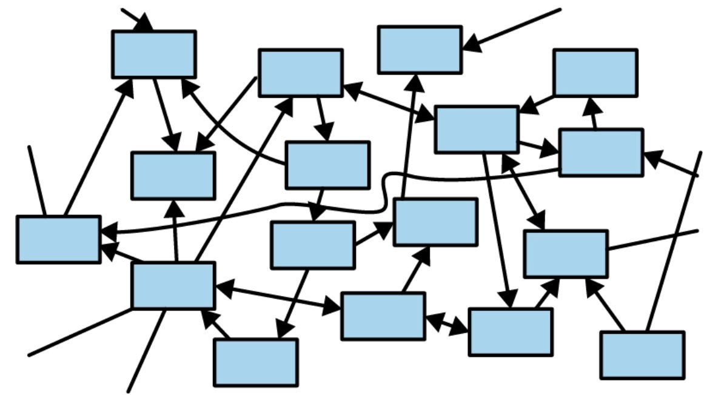
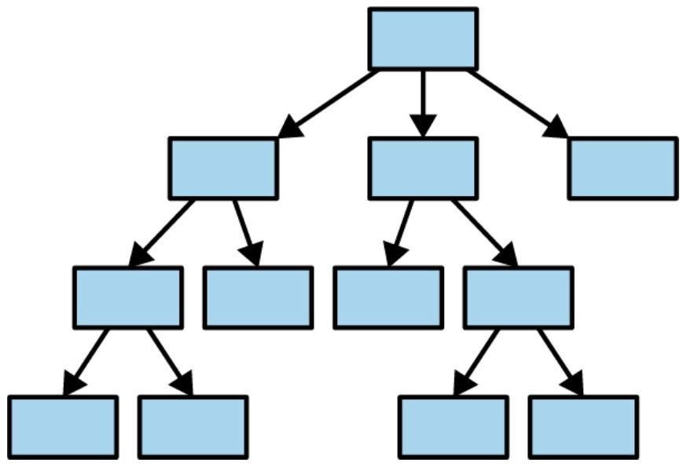

# Beyond If Statements and For Loops
<div class="description">
How pattern matching, type systems, and functional thinking transformed my approach to solving problems.
<span class="date-info"><span class="date">2025-07-27</span></span>
<span class="tags">programming, rust, fp</span>
</div>

## Learned Defaults

Would you believe there is more to writing code than if-statements and for-loops? Revelatory, I know. My programming flow has traditionally consisted of writing nested conditionals, iterating through arrays, wrapping errors in try-catches, and hopefully ending up with a finished product that _works_.

In my intro programming course, we learned basic Java. After arrays, we jumped straight into object-oriented design, data structures, and algorithms. We (briefly) learned the Stream API, but not match expressions, `object instanceof ClassName newVar` (inline type check and declaration), or `var`.[^1] The goal was to teach us OOP fundamentals---not necessarily to write modern Java.

So we wrote code that was verbose, hard to follow, and broke if you looked at it wrong. Functions could do anything, fail mysteriously, or modify state in ways I couldn't trace. It was a labyrinth of side effects I couldn't comprehend. Looking back, I was living in what I now call the "sea of objects"[^2]---everything connected, state flowing unpredictably, dependencies knotted together beyond comprehension.

I spent some time this summer studying idiomatic Rust and familiarizing myself with the functional programming paradigm. Now, I can confidently say I can represent many common programming patterns better than before.

What does 'better' mean? I'd argue we find improvement when we discover patterns that represent our work more efficiently, intuitively, or clearly.

[^1]: Thanks [Ben](https://ben.enterprises/) for the list!!

[^2]: This is terminology I learned in _Programming Rust (2021)_ describing the tangled web of mutable references common in object-oriented programming.

## Pattern 1: From If Chains to Pattern Matching

The first major shift happened when I realized most of my if-else chains weren't about control flow so much as they were about destructuring data and handling different shapes. Instead of asking "what should I do in this situation?", I started asking "what shape is my data, and how do I handle each shape?"

Here's an example of what I used to write:

```python
def process_pokemon(pokemon_data):
    if pokemon_data.get('type') == 'dragon':
        if pokemon_data.get('evolution_stage') == 'final':
            return unlock_legendary_moves(pokemon_data)
        else:
            return locked_to_basic_moves(pokemon_data)
    elif pokemon_data.get('type') == 'normal':
        return access_normal_moves(pokemon_data)
    else:
        return fallback_struggle(pokemon_data)

```

With match syntax, this becomes:

```rust
match (pokemon.ptype, pokemon.evolution_stage) {
    (Dragon, Final) => unlock_legendary_moves(pokemon),
    (Dragon, _)     => locked_to_basic_moves(pokemon),
    (Normal, _)     => access_normal_moves(pokemon),
    (_, _)          => fallback_struggle(pokemon),
}

```

I'll admit I was initially drawn to pattern matching because it looked cleaner. What surprised me was how it forced me to think about my data's structure upfront and handle all possible cases. The compiler literally won't let me forget an edge case.

Rust's pattern matching opened my eyes to a pattern I'd been approximating badly in other languages. Once I saw it clearly, I realized it's everywhere---Swift has it, Python 3.10+ added it, and I can even fake it in JavaScript:

```javascript
// approximated in js w/ objects
const moveHandlers = {
  'dragon:final': (pokemon) => unlockLegendaryMoves(pokemon),
  'dragon:basic': (pokemon) => lockedToBasicMoves(pokemon),
  'normal': (pokemon) => accessNormalMoves(pokemon),
};
const key = `${pokemon.type}:${pokemon.evolutionStage}`;
return moveHandlers[key]?.(pokemon) || fallbackStruggle(pokemon);

```

The insight isn't one of superior syntax. Rather, it's realizing that sometimes I am better served thinking about data shapes instead of control flow.

## Pattern 2: The Type System as Design Tool

Match syntax is a clean and effective way to process different data shapes, but it's just one part of the puzzle. Another question is how we represent our data in the first place.

Here's the kind of code I used to write:

```javascript
const questLog = {
  status: 'active',
  questId: 'save-the-village',
  rewards: null,         // should only exist when completed
  failureReason: null,   // should only exist when failed
  currentObjective: 0,   // meaningless when completed or failed
};

```

What I learned was to make illegal states unrepresentable.

Now I design with the type system:

```rust
enum QuestState {
    Available { questId: QuestId, requirements: Vec<Requirement> },
    Active { questId: QuestId, currentObjective: usize, progress: Progress },
    Completed { questId: QuestId, rewards: Vec<Reward>, completedAt: DateTime },
    Failed { questId: QuestId, reason: FailureReason, canRetry: bool },
}

```

Impossible states are now impossible to represent. I literally cannot have a completed quest without rewards or an active quest without progress tracking.

I've realized the value in using the type system to encode business rules, not just data shapes. When illegal states become unrepresentable, entire categories of bugs just disappear.

Rust showed me this principle clearly, but once I understood it, I could apply it elsewhere---with TypeScript's discriminated unions, or even factory functions in dynamic languages. The principle transcends any particular type system.

## Pattern 3: From For Loops to Transformations

Another way I realized I could clean up my code is by replacing many of my for-loops. I realized most of my for-loops weren't really used for iteration---they executed transformations. I was manually implementing map, filter, and reduce operations when I didn't need to.

My manual approach:

```python
def calculate_raid_damage(party_members):
    total_damage = 0
    for member in party_members:
        if member.is_alive and not member.is_stunned:  # filter
            damage = member.base_damage * member.gear_multiplier  # map
            if member.has_buff('berserk'):
                damage *= 1.5
            total_damage += damage  # reduce
    return total_damage

```

What I learned:

```rust
fn calculate_raid_damage(party: &[PartyMember]) -> f64 {
    party.iter()
        .filter(|member| member.is_alive && !member.is_stunned)
        .map(|member| {
            let damage = member.base_damage * member.gear_multiplier;
            if member.has_buff(BuffType::Berserk) {
                damage * 1.5
            } else {
                damage
            }
        })
        .sum()
}

```

It's more honest about intent. The chain of operations tells me exactly what's happening: filter active members, calculate their damage with multipliers, sum the results. No hidden state, no mutation, no surprises.

### Zero-Cost Iterators

These iterator chains compile to highly optimized assembly. The compiler transforms them into tight loops with minimal overhead---though "zero-cost" is more aspiration than guarantee. Complex chains can sometimes hit optimization limits. But for most code, you get beautiful, functional patterns that run as fast as manual loops.

## Pattern 4: Error Handling

Error handling was where my old patterns really broke down. I went through a clear evolution that was honestly pretty embarrassing in retrospect:

### "Exception Hell"

You've definitely been here before. Look familiar?
```python
def brew_coffee(order):
    try:
        beans = grind_beans(order.bean_type)
        try:
            water = heat_water(order.temperature)
            try:
                coffee = brew(beans, water, order.brew_time)
                return coffee
            except BrewError as e:
                log_error(e)
                raise
        except WaterError as e:
            log_error(e)
            raise CoffeeError("Water heating failed") from e
    except GrindError as e:
        log_error(e)
        return None  # sometimes return None, sometimes raise? great plan!

```

I tried to get smarter about this by making errors explicit in return types:

### Again, but with Explicit Results

```typescript
type BrewResult =
  | { success: true; coffee: Coffee }
  | { success: false; error: string };

function brewCoffee(order: Order): BrewResult {
  // at least now I know this function can fail
}

```

This was better, but chaining these operations was still awkward. Then I learned Rust!!

### The Way of Rust

Learning Rust's `Result<T, E>` and the `?` operator was transformative:

```rust
fn brew_coffee(order: &Order) -> Result<Coffee, CoffeeError> {
    let beans = grind_beans(&order.bean_type)?;         // stop here if grind fails
    let water = heat_water(order.temperature)?;         // stop here if heating fails
    let coffee = brew(beans, water, order.brew_time)?;  // stop here if brew fails
    Ok(coffee)
}

```

Each `?` says "if this step fails, stop here and return the error." No hidden control flow, no forgotten error cases. The function signature tells me exactly what can go wrong.

The `?` operator itself is Rust magic, but the pattern---making errors explicit and composable---that's universal: JavaScript Promises, Go's error returns, even optional chaining. All of these make error cases explicit and composable. Instead of hoping functions won't throw, I design them so they can't hide their failure modes.

## Pattern 5: Ownership

Rust's ownership system completely changed how I think about data relationships. Not just in Rust, but everywhere.

Traditional object-oriented thinking creates a tangled mess where everything points to everything else:

<div style="display: flex; justify-content: center; gap: 40px; margin: 20px 0;"><div style="text-align: center;"><div style="font-style: italic; margin-top: 8px;">Sea of Objects (Traditional OOP)</div></div><div style="text-align: center;"><div style="font-style: italic; margin-top: 8px;">Tree of Values (Rust's Ownership)</div></div></div>

Following data flow becomes impossible in the traditional model:

```python
# complex "web" of mutable references
class QuestLog:
    def __init__(self):
        self.quests = []
        self.active_quest = None

class Quest:
    def __init__(self, quest_log):
        self.quest_log = quest_log
        quest_log.quests.append(self)  # quest modifies its container!
        quest_log.active_quest = self   # mutation from constructor!

```

Rust's ownership system enforces a "tree of values" where each piece of data has exactly one owner:

```rust
struct QuestLog {
    quests: Vec<Quest>,
    active_quest_id: Option<QuestId>,  // ID-based reference pattern
}

struct Quest {
    id: QuestId,
    name: String,
    objectives: Vec<Objective>,  // quest owns its objectives
}

```

Using IDs instead of direct references is a common pattern in Rust (and game development generally) to work around ownership restrictions while maintaining safety. It's basically a controlled form of indirection.

Now I'll grant that I can't enforce these ownership rules in Python or JavaScript. But understanding the model itself has transformed how I design systems everywhere.

### The Constraint-Solver Mindset

Everyone talks about "fighting the borrow checker," and yeah, at first it's infuriating:

```rust
// this won't compile:
let mut data = vec![1, 2, 3, 4, 5];
let first = &data[0];     // immutable borrow
data.push(6);             // mutable borrow - ERROR! :(
println!("{}", first);    // use of immutable borrow

```

My first reaction was pure frustration. Why won't the compiler let me do this simple thing?

But then I realized: this code was always dangerous. In C++, `data.push_back(6)` might reallocate the vector, making `first` a dangling pointer. The program might crash, or worse, silently corrupt memory causing undefined behavior. Rust just makes the problem visible at compile time.

This changed how I think about data dependencies. Now I ask: What owns this data? What can modify it, and when? How can I design this to minimize shared mutable state?

And the whole time, the compiler is showing me problems I didn't even know existed. Hardly the nature of an enemy.

## Pattern 6: Functions That Tell the Truth

I was pleasantly surprised to find that function signatures in Rust are complete contracts:

```rust
// this function promises it won't store the reference
fn process_temporarily(data: &str) -> usize {
    data.len()  // just calculates length and returns
}

// this admits it might fail
fn parse_number(s: &str) -> Result<i32, ParseIntError> {
    s.parse()  // failure is part of the type, not hidden
}

```

Put another way, I literally can't write a function that does sneaky stuff without declaring it upfront. This is because the type system forces honesty through lifetimes and ownership rules.

I learned to design functions so that reading the signature tells me almost everything about what they do. The Result type forces explicit error handling and makes failure part of the type signature. Comments are hardly necessary anymore as the type system does the documenting.

For me, JavaDoc-style comments became largely unnecessary. Instead of:

```java
/**
 * Parses a string representation of a number
 * @param s the string to parse
 * @return the parsed integer
 * @throws ParseIntError if parsing fails
 */

```

Now I just write:

```rust
fn parse_number(input_string: &str) -> Result<i32, ParseIntError>

```

The signature tells you everything: it takes a string reference, might fail, returns an integer on success, and specifies the exact error type. The function signature has become a complete, compiler-verified contract.

## Pattern 7: Monadic Composition

Monads seemed like academic wizardry when I first heard about them, but really they're just about chaining operations where each step depends on the previous one's result.

```javascript
// sequential dependency (must be serial)
const processUser = async (id) => {
  const user = await fetchUser(id);
  const profile = await fetchProfile(user.profileId);  // depends on user!
  const settings = await fetchSettings(profile.type);  // depends on profile!
  return combineData(user, profile, settings);
};

```

That async/await chain? That's monadic composition. Each step feeds its result to the next step, which can examine that result and decide what to do. Once Rust taught me to see this pattern, I realized I'd been using monads all along in JavaScript Promises, optional chaining, even error handling.

Error handling:

```rust
fn process_data(input: &str) -> Result<Output, Error> {
    parse_input(input)
        .and_then(|data| validate_data(data))           // only runs if parse succeeded
        .and_then(|valid| transform_data(valid))        // only runs if validation succeeded
        .and_then(|transformed| save_data(transformed)) // only runs if transform succeeded
}

```

Optional values:

```javascript
const getConfig = (user) =>
  getUser(user.id)
    ?.getProfile()       // only if user exists
    ?.getSettings()      // only if profile exists
    ?.getTheme()         // only if settings exist
    ?? defaultTheme;     // fallback (if any step fails)

```

Scary name, simple idea. It's just chaining operations together.

## Pattern 8: Performance Without Compromise

One of the biggest revelations was that these "high-level" patterns often produce faster code than manual imperative approaches.

```rust
// this functional-style code...
fn process_large_dataset(data: &[f64]) -> f64 {
    data.par_iter()                    // parallel processing
        .filter(|&&x| x > 0.0)         // skip negative values
        .map(|&x| x.sqrt())            // square root transformation
        .map(|x| x * 2.0)              // scale by 2
        .sum()                         // parallel reduction
}

// ...compiles to vectorized assembly that uses SIMD instructions
// and parallel execution across CPU cores

```

I found that modern compilers could optimize my functional patterns better because:

1. Clear data flow - transformations can be vectorized automatically
2. No side effects - aggressive optimization is safe
3. Parallelizable - no shared mutable state means easy parallelization
4. Compiler can reorder operations - pure functions give the compiler more freedom

In my experience, the functional approach had negligible performance overhead while being much clearer.

### Memory Safety Without Garbage Collection

Rust taught me that the choice between performance and safety is a false dichotomy:

```rust
// rust: safe AND fast
fn process(huge_dataset: &[String]) -> Vec<String> {
    huge_dataset.iter()
        .map(|item| expensive_transform(item))
        .collect()
    // memory safety guaranteed at compile time
    // no GC pauses, no leaks, no undefined behavior
    // performance identical to C++
}

```

By making ownership explicit in the type system, Rust eliminates the runtime overhead of safety checks while maintaining complete memory safety.

Rust shows that the choice between performance and safety is false. You can have both. But the broader lesson applies everywhere: functional patterns have become fast enough that performance rarely justifies avoiding them. Modern JS engines have largely closed the gap between map/filter/reduce and manual loops. Java's Stream API trades some speed for readability and parallelization, a worthwhile tradeoff for most code. The old excuse of 'functional programming is too slow' just doesn't hold up anymore.

## Pattern 9: Composition

The final pattern that changed everything was learning to build complex behavior from simple, composable pieces.

Before, I had massive, monolithic functions:

```python
def craft_legendary_weapon(player, materials, recipe):
    # 200+ lines of mixed concerns:
    # - validate materials, check requirements, consume resources
    # - calculate success chance, apply buffs, handle failures, etc.
    pass

```

Then, I tried refactoring to composable pipelines:

```rust
fn craft_legendary_weapon(
    player: &Player,
    materials: Materials,
    recipe: Recipe,
) -> Result<LegendaryWeapon, CraftingError> {
    recipe
        .validate_materials(&materials)?
        .check_player_level(player)?
        .check_crafting_skill(player)?
        .consume_materials(&mut player.inventory)?
        .calculate_success_chance(player.stats)?
        .attempt_craft()?
        .apply_enchantments(player.available_enchants)?
        .finalize()
}

```

I found this better because each function has a clear contract and no side effects. I can test them in isolation, combine them in different ways, and reason about the whole system by understanding the parts.

## What Actually Changed

All of these patterns changed something fundamental about how I write code. I used to obsess over the exact sequence of steps: this loop, then that condition, then update this variable. Now I think more about transformations: take this data, filter it, transform it, combine it.

This wasn't only a philosophical journey. When I stopped mutating everything in sight, parallelization got easier (though 'trivial' is a stretch—concurrency is still hard sometimes). When functions started telling the truth about what they could fail at, I spent less time in the debugger. When I learned to build big things from small, composable pieces, the complexity became less overwhelming.

Not everything improved. Rust's ownership makes performance more predictable, sure, but in other languages I'm still guessing. And strong types only help if you design them well. Bad types just move the problems around.

But overall? The code is easier to reason about. Bugs tend to be shallower. And yeah, it's more fun to work with systems where the pieces actually fit together.

## How to Start

I started small. I replaced one complex if-else chain with a lookup table just to see what would happen. It worked, so I tried another. Then I noticed some of my for-loops were really just filters and maps in disguise.

The compiler was vexing at first. Like, genuinely maddening. But those moments when things finally clicked, when I understood why the borrow checker was saving me from myself, when I saw how composition could replace complexity, made it worth pushing through.

What surprised me was the compound effect. Each pattern made the next one easier to see. Pattern matching led me to better data types, which made error handling obvious. It builds on itself.

## Where This Leads

I'm still figuring things out. Half the time I write crude imperative code when I'm prototyping, then come back and clean it up with these patterns.

The real shift was learning to see programming as a design discipline rather than just instruction-writing. The patterns I've shared aren't rules. They're tools I reach for when the code starts feeling unwieldy.

Some of what I've shown, like the borrow checker and zero-cost abstractions, are Rust's unique gifts. But the mental models they taught me transformed how I write JavaScript, Python, everything.

The rest tends to follow from there.
