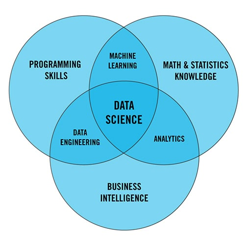

# CS + Data Science Done Right

Why most students waste this easy double major combination and how to actually build valuable skills instead of just collecting credentials.
2025-08-15
college, programming, math, stats

## Introduction

I am what feels like moments away from finishing my double major in Computer Science and Data Science, and I'll be receiving my piece of paper from UW-Madison soon (knock on wood). I consider myself principally a Computer Scientist, which is why it caught my attention when, during my time hanging around my Comp Sci friends, I heard over and over, "data science is a fake major!"---Now, granted, at my university I can understand the sentiment. At UW-Madison, if you start as a CS major, you only need to tack on five additional classes to get Data Science. And there's definitely a minimum resistance path where students can "skirt through" the more information-dense and challenging courses and learn essentially nothing. I'm writing this today to share what I did and how I feel I will leave UW not clueless about data science, but relatively well-versed in the tools of the Data Scientist.

## Disclaimer

I'm going to share with you *my* path. While I'm convinced it's near optimal with regard to a balance of content and time efficiency, it is not the only path that will leave you feeling fulfilled. As always: use a combination of <a href="https://madgrades.com/" target="_blank">madgrades.com</a> (for GPA) and <a href="https://www.ratemyprofessors.com/" target="_blank">ratemyprofessor</a> (for professor reviews) to guarantee you don't shoot yourself in the foot. **As a general rule, I have never taken a professor with a rating ≤ 2.7.**

## Courses

### The Boilerplate

The boilerplate in the Data Science major is the set of classes I had to go through no matter what: the R programming and tidyverse tutorial (<abbr title="Data Science Modeling I">STAT 240</abbr>), AP Stats 2.0 (<abbr title="Data Science Modeling II">STAT 340</abbr>), and the yucky gobbledygook of intro to "data science programming," a.k.a. Python (<abbr title="Data Science Programming I">CS 220</abbr> & <abbr title="Data Science Programming II">CS 320</abbr>). I endured that slog, and then I was out! Only interesting classes remained.

### Good Courses

Since I was a computer science major first, I had already set my sights on a few interesting classes with ties to data science. I'd already tackled <abbr title="Introduction to Algorithms">CS 577</abbr>, which covered greedy algorithms, divide and conquer, dynamic programming, and computational complexity. This course provided the theoretical foundation that makes understanding distributed systems possible.

First and foremost, I took big data systems with Tyler Caraza-Harter (<abbr title="Introduction to Big Data Systems">CS 544</abbr>), where I learned how massive tech companies actually handle billions of users' data using tools like Spark and Hadoop, which companies like Meta use to process their 4 petabytes of daily data. That same semester, I took databases with AnHai Doan (<abbr title="Database Management Systems: Design and Implementation">CS 564</abbr>), which taught me the theory of how databases work under the hood. We only spent a week on SQL, and AnHai joked that if I couldn't understand it by that point, I should take a community college course! Valid and refreshing. The real focus was on things like how databases physically store data on disk, buffer management, and B+ tree indexing.

I also took <abbr title="Statistical Data Visualization">STAT 436</abbr> to learn precisely when to use precisely what data visualization to represent data.

### Great Courses

One of my favorite classes period was <abbr title="Data Exploration, Cleaning, and Integration for Data Science">CS 774</abbr> with AnHai. I liked his databases class in the fall, so I sought out his grad class in the spring. This was incredibly worth it because it broke down how things *actually* work in the real world. It dissipated a lot of the cloudy naïveté I had as an undergraduate about data science being clean datasets and straightforward analysis. In the real world, data is messy, fragmented, and low-quality. Most of your time is spent on data wrangling---acquiring, cleaning, matching, and integrating data sources. It takes a lot of work to even begin to *think* about insights. AnHai's blunt, practical approach ("Nobody wants to give you data... take them out for Indian food and fill them with beer" and his favorite reminder that "Nothing is free in life!") honestly stripped away a lot of my academic idealism and prepared me for the actual challenges I'd face as a data scientist.

This upcoming semester, I will take <abbr title="Matrix Methods in Machine Learning">CS 532</abbr>. It covers linear algebraic foundations of machine learning with real-world applications from classification and clustering to denoising and data analysis. Topics include linear equations, regression, regularization, singular value decomposition, support vector machines, kernel methods, clustering, and neural networks. It's the talk of the town and dear god has it been hard to get into. But I've finally got it.

## An Internship Helps

Like it or not, skills are forged in fire and a data science internship is a perfect opportunity to test your mettle. It's a rough market, but if you look high and low, and commit yourself, I have no doubt you will find a window of opportunity.

An internship is great because it situates you (the data scientist/software engineer) within the broader structure of a business. I was quickly inundated with talk of <abbr title="Key Performance Indicators">KPIs</abbr> and deliverables. I learned to frame my accomplishments in a way my audience would understand---either at the strategic or tactical level[^1].

I learned how to interact with other human beings, work together, hash out issues and team up. I learned how gritty real-world data is, how messy a database can be, and what silly company policies make your idealism fade quickly away and get replaced with the vigor of "I'm working with what I've got and that's okay."

It's frustrating, it's wonderful, and you learn a ton.

[^1]: Strategic level focuses on high-level business goals and long-term impact (e.g., "This model increased customer retention by 15%"). Tactical level focuses on specific technical implementations and immediate deliverables (e.g., "Built a feature engineering pipeline that reduced processing time by 40%").

## For Readers: Probabilistic Machine Learning

If you are a reader looking for a tome to study and study well, look no further than <a href="https://www.goodreads.com/book/show/58064710-probabilistic-machine-learning" target="_blank">*Probabilistic Machine Learning: An Introduction*</a>.[^2] The book covers foundations (probability, statistics, linear algebra), linear models, deep neural networks, nonparametric methods, and advanced topics like clustering and recommender systems. This book takes *time* and I'm hardly done, but I've done a ton of research online and this is the best book out there right now. Murphy also has a second volume, *Probabilistic Machine Learning: Advanced Topics*,[^3] which dives into cutting-edge research areas like variational inference, generative models (VAEs, GANs, diffusion models), reinforcement learning, and causal inference.

If you've looked around for similar texts, you've probably heard of <abbr title="Introduction to Statistical Learning">ISL</abbr> and <abbr title="Elements of Statistical Learning">ESL</abbr>. The *Introduction to Statistical Learning*[^4] and *Elements of Statistical Learning*[^5] are the classic statistics-focused texts that most people recommend. The <abbr title="Probabilistic Machine Learning">PML</abbr> is for computer scientists what this pair of books is for statisticians---two sides of the same coin. It's worth mentioning the PML is more up to date and approaches machine learning from a more algorithmic, computational perspective rather than the statistical inference focus of ISL/ESL.

[^2]: Murphy, Kevin P. *Probabilistic Machine Learning: An Introduction*. MIT Press, 2022.
[^3]: Murphy, Kevin P. *Probabilistic Machine Learning: Advanced Topics*. MIT Press, 2023.
[^4]: James, Gareth, et al. *An Introduction to Statistical Learning*. Springer, 2021.
[^5]: Hastie, Trevor, et al. *The Elements of Statistical Learning*. Springer, 2009.

## Comparing Math, Stats, and DS for CS Majors

They say a picture is worth a thousand words:

Data Science = Programming ∩ Math/Stats ∩ Business Intelligence[^6]

As a hybrid major, data science gives you a taste of everything but mastery of none. The diagram above shows the reality of what this field actually is---not a standalone discipline, but the overlap between three distinct areas of expertise.

Pairing CS with a more "pure" major like Math or Statistics avoids some of the dregs you encounter in hybrid programs. You skip the watered-down intro courses designed for people who've never coded before. You avoid the awkward positioning where you're getting a diluted version of mathematical concepts filtered through a "data science" lens.

Instead, you develop deep mathematical or statistical maturity that carries you far beyond any specific tool or framework. Real analysis teaches you to think rigorously about limits and continuity---and yes, working through Rudin (our own UW-Madison Walter Rudin's *Principles of Mathematical Analysis*) will make you a fundamentally better thinker. Advanced statistical theory gives you the foundation to understand why methods work, not just how to apply them.

That said, if I had to do it all over again, I think I'd choose CS + Math or CS + Stats. The mathematical maturity you develop creates a foundation that transcends any particular technology.

Ultimately, the choice depends on your goals: breadth and efficiency (CS + DS) or depth and long-term foundation (CS + Math/Stats). The key is intentionally taking the right classes and collecting the right skills, rather than opting for the easy road, collecting credentials, and walking out the door.

[^6]: Source: Flatiron School
