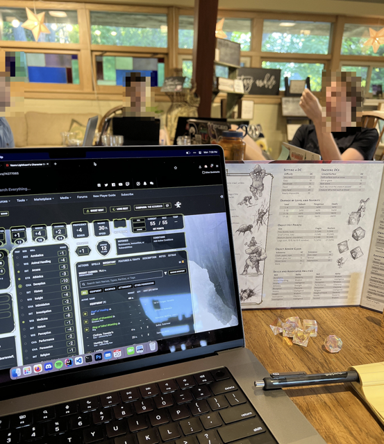

# Dungeons, Dragons & Development
Date: 2025-04-21

> Creating custom ("homebrew") D&D worlds and developing software are surprisingly similar as creative disciplines. In both, you create vast interconnected "worlds" which must remain cohesive while evolving over time.

  
 have been roleplaying and building worlds for a decade this May[^1]. In that time, I have met dozens (perhaps hundreds) of fantastic individuals who have taught me an incredible amount about what works, what doesn't, and how to build a player's trust in you as a game master[^2] (GM). When I'm not at the table with my friends, I am often programming. I will be graduating soon with a degree in Computer Sciences from the [University of Wisconsin-Madison](https://cdis.wisc.edu/). I still have a lot to learn in both disciplines, but insofar as my current knowledge extends, I see compelling similarities between them. The creative challenges faced by worldbuilding game masters parallel those of software engineers, particularly in managing system complexity, sustaining creative momentum, and designing flexible systems that adapt to change.

## Building Worlds

In a sense, creating homebrew worlds mirrors designing software. The worldbuilding process is an asymptotic journey toward an ideal. You begin with an empty canvas, add and strip away elements, and constantly refine towards some "just right" state that can never be fully reached[^3]. Each revision brings the world closer to this theoretical ideal, but you can't build forever. You must eventually settle on a final approximation. This gap between vision and implementation persists no matter how much effort you invest. It reminds us that perfect worldbuilding remains perpetually out of reach, even as we work to minimize the distance between our creation and our imagination. At the end of this process, the creator has established consistent rules, and a living, breathing fantasy world.

Map A. The Isles (2020)

Map B. Aldria (2021)

Map C. El'kora (2024-)

This model works equally well for computer programming. While tabletop roleplaying gives us dragons and magic, coding offers a different kind of creativity. Indeed, programmers build out "worlds" of their own, maintaining coherence in two ways: internally through well-structured, maintainable code for developers, and externally through intuitive interfaces for users. We design data structures and algorithms, and establish design patterns and software interfaces. Like worldbuilders, programmers must deeply understand how each component affects the entire system when changed or extended. Intuitive, right?

One challenge which arises in both disciplines is dropping in new elements without disrupting the equilibrium of the existing system. It is a balancing act. As a GM, when I introduce a new culture, cast of story characters, or archetype of magic[^4], I must do so by carefully weaving my addition into existing lore without creating contradictions or diminishing what came before. For instance, when I created a new seafaring merchant kingdom for my campaign (Tayrest on map A, above), I had to ensure their cultural practices made sense given their proximity to existing nations, and that their history fit coherently into the world's timeline. Similarly, software engineers adding new features or services to an existing codebase must ensure compatibility with existing functionality while avoiding regression issues. In both domains, you must approach these additions systematically and anticipate how new additions will ripple through your existing creation and potentially cause unintended consequences.

This systemic thinking extends to the management of accumulated knowledge, where I feel both roles struggle with documentation debt. Earlier on in my adventures as a game master, I kept almost everything in my head. Even things I knew I wouldn't utilize for months. Not good. To remedy this, many GMs compile extensive [world wikis](https://hatch-books.com/blog/world-bible), campaign notes, NPC directories, bestiaries, etc. But even they gradually become unwieldy and difficult to reference during play. Software engineers face identical challenges with technical documentation, javadoc-type comments, and API references that quickly fall out of sync with evolving codebases. In both domains, the struggle to maintain current reference materials creates friction that compounds over time. Outdated information becomes increasingly misleading as systems evolve.

In summary, there exists a tension with which both disciplines do battle--between vision and reality--forcing worldbuilders to become architects of imperfect systems, creating frameworks that balance ambitious ideas with practical constraints. Perfection is unattainable. The art I've grown to love lies in crafting worlds resilient enough to evolve without collapsing under their own complexity.

## Fighting Bloat and Feature Creep

When designing a world or a piece of software, it takes a lot of willpower to stop adding more. For me, at least. I hyperfixate on my current project and build it up with all of my creative power. Depth, breadth, a grand scale. It is hard to stop. But you're not building the world to build the world. You're building it to tell a story. And I've learned the most important part of a story is how it ends. A refined, precise, complete story which serves a purpose. The world and everything in it is a tool to deliver the story to your players, the real humans who sit down with you and play every week (or as much as they can). Don't get me wrong, building out new intricacies in my world is endlessly therapeutic. But I have to reign myself in once and a while and remind myself that while my mind has near-bottomless capacity for this type of thing, my players have limited mental bandwidth and ***playtime***. Much of what I create will never see the light of day. And it shouldn't. Players can only absorb and remember so much information during our sessions, and what seems crystal clear to me often gets lost in translation because I have the complete picture while they only see the fragments I've explicitly shared. Again, a good GM delivers a refined, precise and complete story. With an end.

Software engineers face this same struggle. The excitement of introducing new functionality can lead to bloated codebases that become difficult to maintain and confusing for users. Just as a game master must remember their players have limited playtime and mental capacity for new information, developers must consider that users want software that solves their problems efficiently, not necessarily software that does everything imaginable.

The focus to design a refined, precise, and complete world--rather than an endlessly expanding one--is a quality that, for me, distinguishes the very best. Fundamentally, one must balance introducing enough content that the system feels hearty and fully fleshed out, but not so much as to create an overwhelming noise-to-signal ratio.

## Preventing Burnout

The creative drive that fuels both worldbuilding and programming can be all-consuming. I've definitely had nights where I've been up past 3 AM sketching out political conflicts between fictional kingdoms or perfecting the backstory of an NPC my players might never even meet. This passion is a double-edged sword. On one hand, it's the engine that drives creation. On the other, it's a direct path to burnout when left unchecked. Now, frankly speaking, I'm happy to let this particular sword hack me to pieces, but for the sake of the argument this section is trying to make, we'll label this a "challenge".

<figure style="text-align: center">
    
    <figcaption style="text-align: center; font-style: italic; margin-bottom: 10px;">Wiki-style lore respositories I've written (where each page contains a character, location, or info page, etc.)</figcaption>
</figure>

Game masters often feel pressure to constantly innovate, balancing creative preparation with improvisation as player actions often derail carefully planned scenarios. After months of this cycle, even the most enthusiastic GM can find their creative well running dry. In situations like these, the cruel irony is that the hobby once chosen as an escape transforms into something they themselves now feel the need to escape from. What began as passion you looked forward becomes an obligation you stress about.

I feel like software developers battle similar demons. The pressure to deliver features, fix bugs, meet deadlines, and stay current with rapidly evolving technologies creates a perfect storm for burnout. And I'm not saying it's not fun--it is. I like the pace and the challenge. But it adds up over time, and it's helpful to keep that fact in the back of your mind. Both roles demand a constant outpouring of creative and technical solutions, and I think we often grant too limited recognition of the mental and emotional cost.

Boundaries are good. "But Nico-Nico! Does that mean you advocating for work-life balance? And in this economy!?" I think so. For GMs, this might mean limiting worldbuilding to defined time blocks and embracing pre-made content when appropriate. For developers, it means timeboxing problems and recognizing when good enough is truly good enough. In both fields, the myth of the tireless creator producing flawless work has damaged far more people than it has helped. As my professor AnHai Doan once said, ***"There is nothing perfect in life!"***

So, don't be afraid to prioritize self-care. If you're overwhelmed, cancel a session--your players *will* understand. And yes, while software engineering sometimes requires sprints for critical deadlines, try your best to balance these with recovery time. Your mental health deserves protection, no matter what others think, and well-rested work will always outshine what you create while exhausted. And if you've spent the last 120 hours on-call working non-stop for the lesser of the two "A"'s in FAANG, I'm sorry. Please get well soon.

The bottom line: pace yourself. Some weeks that means canceling a session to recharge. Other weeks it means pulling an all-nighter because you're genuinely excited about what you're building!! But make those choices consciously, not out of obligation or fear of letting people down. Be sustainable. Know your own limits. And occasionally ignore them for the right reasons :)

## Adaptating to Change

One of the most important lessons I've learned in a decade of GMing is that player agency is sacred. For players to truly invest in your world, they must believe--no, they must know *unequivocally*--that their choices matter. This trust isn't built through elaborate pre-scripted monologues that rival [Lelouch's "Obey Me, World"](https://www.youtube.com/watch?v=sjgUXY4U3JI), or [meticulous, Mercer-tier narrations](https://www.youtube.com/watch?v=V0hV5MtC4Vw), but through your consistent willingness to adapt your creation, no matter how "grand" or "mighty" its scale, to your players' decisions.

Many of the moments which have stuck with me, years later, came from sessions where I hadn't looked at my prepared notes for hours. Situations that arose when players pursued an unexpected thread and things "flew off the rails"... but, in a good way! These moments, while nerve-wracking, are actually where the magic happens. When you're comfortable enough with your world to seamlessly improvise while appearing prepared, players become genuinely immersed. The agency is in their hands and they can do *whatever* they want. Conversely, when you railroad players along predetermined paths that feel unintuitive or forced, their engagement evaporates as they realize they're merely pawns in your[^5] story.

<figure style="text-align: center">
    
    <figcaption style="text-align: center; font-style: italic; margin-bottom: 10px;">My friends!! (Summer 2022)</figcaption>
</figure>

Software development follows a similar pattern. My most successful coding projects have been those where I remained flexible to changing requirements rather than clinging to initial designs. I've had to rewrite projects many times because I realized my initial assumptions or designs were just plain wrong. Just as a good GM adapts their world to player choices, effective programmers are ready to adapt and refactor their code to best handle real-world usage patterns and requirements. They prioritize refactorability, extensibility, and scalability. Creation isn't a linear process but a dialogue--between GM and players, between developers and users.

The willingness to adapt reveals a difference in perspective that separates beginners from veterans in both fields: recognizing that creation isn't about executing a predetermined plan, but rather maintaining the invariant that whatever you build can actively evolve to accommodate ongoing feedback. Many people have an idea of what they want. They go, they make it. Then they want something else. They do that too. Eventually, they have a messy web they have to wrangle. If instead you build from the outset with control in mind, you don't have a messy web anymore, but an organized map. This mindset transforms rigid structures into living frameworks capable of becoming something better than you initially imagined. To be honest, I haven't worked on many teams, but the few senior engineers and team leads I've encountered consistently emphasized this approach.

## Collaborating

At its core, worldbuilding thrives on collaboration. My most memorable roleplaying scenarios weren't those with the deepest lore or the most perfectly balanced encounters--instead, my favorite moments emerged organically from how my players' choices interwove and built upon the framework I provided. The world was alive because I wasn't its only author.

In my opinion, the best software, too, evolves through consistent and transparent dialogue between creators and users. Open source projects demonstrate this principle perfectly: communities of developers contributing to codebases that far exceed what any individual could create alone. Even proprietary software benefits from beta testing[^6], user feedback loops, and cross-functional teams (i.e., groups of engineers, designers, PMs, and QA specialists working together toward shared goals).

Different types of collaboration appear in both domains:

- Planned collaboration occurs when multiple creators intentionally work together toward defined goals. For game masters, this might mean co-creating a campaign setting with players during a "session zero," while developers achieve this through agile methodologies and planned sprints.

- Emergent collaboration happens when users unexpectedly extend or transform the original creation. I think of players developing complex relationships between their characters that I could have never anticipated, or users discovering innovative uses for software features that developers never imagined.

- Feedback-driven evolution is another mode of collaboration where creators respond to how their work is actually used rather than how they assumed it would be used. I've had a lot of fun redesigning entire campaign arcs based on unexpected player decisions; similarly, many product teams pivot features based on user behavior patterns and feedback.

Both disciplines require balancing creative vision with what the audience actually wants. This means maintaining the humility to recognize when your brilliant idea isn't working, and the flexibility to adapt.

To me, the most rewarding creative experiences happen when we step back from being the sole author and instead create spaces where others can contribute meaningfully. This doesn't diminish our work. In reality, it enhances it, transforming our initial ideas into something far richer than we could have built alone.

## Using What You Have

Both game masters and programmers must balance technical mastery with creative expression. As a GM, I've spent hundreds of hours perfecting homebrewed game elements (custom items, classes, etc.) and designing balanced encounters--the technical foundation that supports the creative storytelling. Similarly, in programming, clean and intuitive code architecture provides the foundation for innovative features and an enjoyable user experience.

In both disciplines, the technical and creative elements are inseperable. I could have the most brilliant narrative concept in the world, but it would fall flat without solid game mechanics to support it. I could have the most elegant helper function known to man, but if the feature just doesn't make sense, it is wasted.

You have to develop both sides of this equation. You can take your technical constraints (what you actually "have" available) and use them to inspire a creative solution rather than regarding them as the limiting factor.

Use what you have, keep it simple, question everything.

## Wrapping Up

I've done my best to highlight the interesting parallels that exist for a game master and a software developer. Worldbuilding is a generalizable skill in disciplines where you create. Over the years, I have found that lessons from one domain consistently enrich my practices in the other.

Whether we're crafting magical realms or coding up projects, common challenges include managing complexity, avoiding feature bloat, preventing burnout, and adapting to unexpected changes. Success in either field requires not just technical knowledge or creative imagination, but an understanding of how what you build interfaces with the user. Are we building what we're building with them in mind?

Perhaps most importantly, both disciplines teach humility. No matter how brilliant our creations may seem in our minds, their true value lies in how they serve others. The perfect world only exists in our minds, and it is our job to create the best approximation we can in the time that we have. By embracing these constraints rather than fighting them, we open ourselves to discoveries and collaborations which far surpass the original vision.

I plan to continue worldbuilding, both as a software engineer and a game master, for the foreseeable future. In doing so, I carry these shared insights forward. May your own creative endevours, whatever form they take, benefit from the wisdom worldbuilding has to offer.

## Footnotes

[^1]: Over the last ten years, I've explored roleplay across many mediums, both online and in-person. I began with Star Wars forum RP (2015) before moving to BioWare's MMO *Star Wars: The Old Republic* ("SWTOR") (2016-2019). In late 2019, I explored *World of Warcraft*, *Final Fantasy XIV Online*, and *Elder Scrolls Online* ("ESO"). During COVID (2020-2021), I finally turned on the microphone and invested 2300 hours in DayZ roleplay with the True Survival Roleplay community; concurrently, I began playing Dungeons & Dragons 5e seriously, enjoying a 42-week campaign with my high school friends. Now, with TSRP finished, my focus centers on tabletop RPGs.

[^2]: In this post, I will use the phrase "game master". I feel it is the most generalizable title. In Dungeons & Dragons, this individual is called the "Dungeon Master". But, D&D is far from the only tabletop RPG out there. In general, I am referring to the the player who acts as the storyteller, referee, and world-builder, guiding the adventure for the other players.

[^3]: Worldbuilding (modeled mathematically) can be described by: Let $W(t)$ be our world at time $t$, $I$ our ideal state. For any $\varepsilon > 0$, there exists time $t$ where $|I - W(t)| < \varepsilon$, yet practical constraints force stopping at time $T$, leaving $W(T)$ as our final approximation.

[^4]: Most recently, I tried introducing an amped-up form of [chronurgy](https://dnd5e.wikidot.com/wizard:chronurgy) which was basically "math magic". It uses geometric patterns as temporal anchors, applies constants like $\pi$ and $\phi$ to solve temporal equations, and leverages [chaos theory](https://fractalfoundation.org/resources/what-is-chaos-theory/) to predict probability timelines. Practitioners can create stable time fields through perfect geometric forms, calculate probability branches with mathematical precision, and use prime numbers to identify "temporal primes" -- moments resistant to alteration. Sort of nerdy, but it actually slots in rather well with existing subclasses. I stayed up until 3 AM on this one.

[^5]: As the Dungeon Master, you have [*unlimited power*](https://img.salm.dev/u/eAYkcU.gif) within your world, but that power must exist solely to enhance your players' experience. Everything (no, not *almost* everything—**everything**!) has to serve their enjoyment, not your ego. They allocate an immense amount of time and trust to you. The same principle applies to software: technical brilliance means nothing if it doesn't actually solve users' problems in a way they find intuitive and accessible.

[^6]: Ahem, do make sure you *pay* your beta testers. The gaming industry especially does this weird thing where they expect fans to beta test for free when they really should be hiring on a specialized team.
