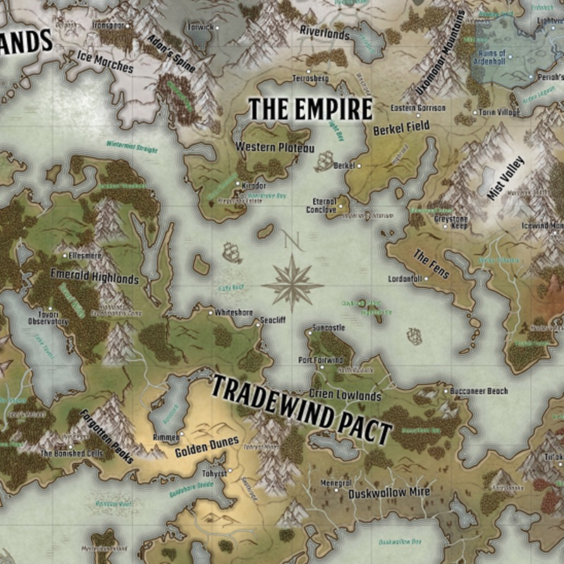
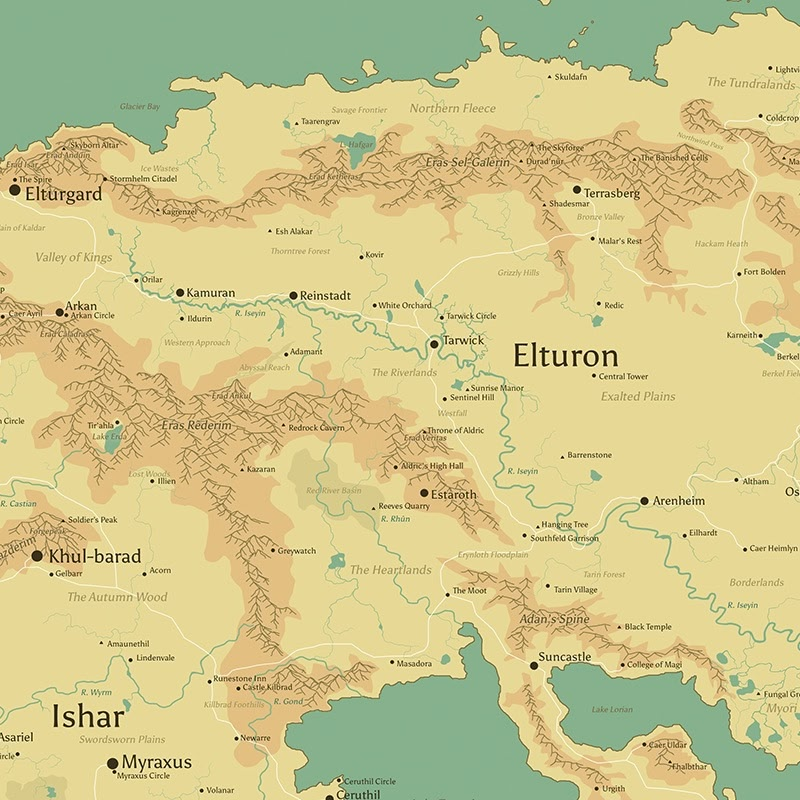
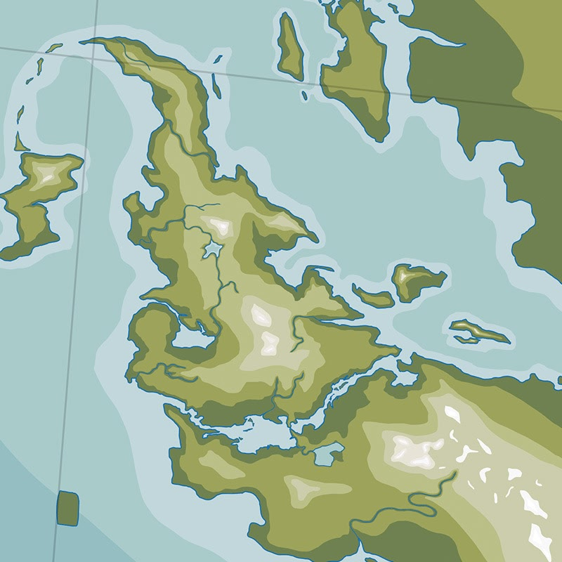

# Dungeons, Dragons & Development
<div class="description">
Creating custom ("homebrew") D&D worlds and developing software are surprisingly similar as creative disciplines. In both, you create vast interconnected "worlds" which must remain cohesive while evolving over time.
<span class="date-info"><span class="date">2025-04-21</span></span>
</div>

## Building Worlds
I have been roleplaying and building worlds for a decade this May[^1]. In that time, I've learned a tremendous amount about what works in worldbuilding and how to build player trust as a game master[^2] (GM). When I'm not at the table with friends, I'm programming---graduating soon with a Computer Science and Data Science degree from the [University of Wisconsin-Madison](https://cdis.wisc.edu/). The creative challenges faced by worldbuilding GMs parallel those of software engineers, particularly in managing complexity, sustaining creative momentum, and designing flexible systems that adapt to change.

Creating homebrew worlds mirrors designing software. The worldbuilding process is an asymptotic journey toward an ideal. You begin with an empty canvas, add and strip away elements, and refine towards a "just right" state that can never be fully reached. This gap between vision and implementation persists regardless of effort invested. At the end of this process, the creator has established consistent rules and a living, breathing fantasy world.

```{=html}
<div style="display: flex; justify-content: space-between; margin: 20px 0; padding: 20px 20px;">
  <div style="text-align: center;">
    
    <div style="font-style: italic;">Map A. The Isles (2020)</div>
  </div>
  <div style="text-align: center;">
    
    <div style="font-style: italic;">Map B. Aldria (2021)</div>
  </div>
  <div style="text-align: center;">
    
    <div style="font-style: italic;">Map C. El'kora (2024-)</div>
  </div>
</div>
```

This model works equally well for programming. Programmers build "worlds" of their own, maintaining coherence internally through well-structured code and externally through intuitive interfaces. We design data structures, algorithms, and establish design patterns. Like worldbuilders, programmers must understand how each component affects the entire system.

One challenge in both disciplines is adding new elements without disrupting the existing system. As a GM, when I introduce a new culture or type of magic, I must weave it into existing lore without creating contradictions. When I created a seafaring merchant kingdom (Tayrest on map A), I ensured their cultural practices made sense given their proximity to existing nations. Similarly, software engineers adding features must ensure compatibility with existing functionality while avoiding regression issues. In both domains, you must anticipate how additions will ripple through your creation.

This extends to knowledge management, where both roles struggle with documentation debt. Many GMs compile extensive [world wikis](https://hatch-books.com/blog/world-bible), campaign notes, and NPC directories that gradually become unwieldy. Software engineers face identical challenges with technical documentation that quickly falls out of sync with evolving codebases. The struggle to maintain current reference materials creates friction that compounds over time.

Both disciplines require creators to balance ambitious ideas with practical constraints. The art lies in crafting worlds resilient enough to evolve without collapsing under their own complexity.

## Fighting Bloat and Feature Creep

When designing a world or software, it takes willpower to stop adding more. I hyperfixate on current projects and build them up with all my creative energy. But you're not building the world to build the world---you're building it to tell a story! And the most important part is how it ends: a refined, precise, complete story that serves a purpose. The world is merely a tool to deliver that story to your players.

I've learned this the hard way. I once spent weeks crafting an elaborate side quest involving ancient ruins with detailed political backstory, custom monsters, and three different possible outcomes. I was so excited to unveil it. The players walked right past every hint I dropped, completely ignored the mysterious NPCs trying to guide them there, and decided to start a tavern business instead[^3]. All that preparation became expensive scratch paper.

Building intricacies in my world is therapeutic, but I have to rein myself in and remember that while my mind has near-bottomless capacity for this, my players have limited mental bandwidth and ***playtime***. Much of what I create will never see the light of day, and it shouldn't. Players can only absorb so much information during sessions, and what seems crystal clear to me often gets lost in translation.

Software engineers face this same struggle. The excitement of introducing new functionality can lead to bloated codebases that become difficult to maintain and confusing for users. Developers must remember that users want software that solves their problems efficiently, not necessarily software that does everything imaginable.

Learning to design a refined, precise, and complete world---rather than an endlessly expanding one---distinguishes the very best creators. I've found that balancing enough content to make the system feel hearty and fully fleshed out, without creating an overwhelming noise-to-signal ratio, is one of the hardest skills to develop.

## Preventing Burnout

The creative drive that fuels both worldbuilding and programming can be all-consuming. I've definitely had nights up past 3 AM sketching political conflicts between fictional kingdoms or perfecting an NPC's backstory my players might never even meet. This passion is a double-edged sword, driving creation but leading to burnout when unchecked.

<figure style="text-align: center; margin: 20px 0;">
    
    <figcaption style="text-align: center; font-style: italic; margin-bottom: 10px;">Wiki-style lore respositories I've written (where each page contains a character, location, or info page, etc.)</figcaption>
</figure>

Game masters often feel pressure to constantly innovate, balancing preparation with improvisation as player actions derail planned scenarios. After months of this cycle, even the most enthusiastic GM can find their creative well running dry. The cruel irony is that the hobby once chosen as an escape transforms into something they themselves now feel the need to escape from.

Software developers battle similar demons. The pressure to deliver features, fix bugs, meet deadlines, and stay current with evolving technologies creates a perfect storm for burnout. Both roles demand a constant outpouring of creative and technical solutions, with limited recognition of the mental cost.

I've learned that boundaries are essential. "But Nico-Nico! Does that mean you advocating for work-life balance? And in this economy!?" I think so. For GMs, this might mean limiting worldbuilding to defined time blocks. For developers, it means timeboxing problems and recognizing when good enough is truly good enough. As my professor AnHai Doan once said, ***"There is nothing perfect in life!"***

I've had to learn not to be afraid to prioritize self-care. If you're overwhelmed, cancel a session---your players *will* understand. While software engineering sometimes requires sprints for critical deadlines, I've found it's important to balance these with recovery time. Your mental health deserves protection, and well-rested work will always outshine what you create while exhausted.

The bottom line: pace yourself. Some weeks that means canceling a session to recharge. Other weeks it means pulling an all-nighter because you're genuinely excited about what you're building! Make those choices consciously, not out of obligation. Be sustainable and know your limits.

## Adapting to Change

One of the most important lessons from a decade of GMing is that player agency is sacred.

For players to truly invest in your world, they must know *unequivocally* that their choices matter. This trust isn't built through elaborate pre-scripted monologues that rival [Lelouch's "Obey Me, World"](https://www.youtube.com/watch?v=sjgUXY4U3JI), or [meticulous, Mercer-tier narrations](https://www.youtube.com/watch?v=V0hV5MtC4Vw), but through your consistent willingness to adapt your creation to your players' decisions.

I learned this the hard way when I prepared an entire plot hook around a conspicuous character who would offer the party a job and help them resist the oppressive government. I had this whole rebellion storyline planned out. Instead, my players turned that character in to the authorities and started helping who I was trying to assert was the "enemy!"[^4] I had to completely redesign the campaign on the fly, turning my carefully crafted rebels into the antagonists and making the authoritarian regime actually reasonable. It was terrifying but became one of our best story arcs.

Many of my most memorable moments came from sessions where I hadn't looked at my prepared notes for hours---situations where players pursued unexpected threads and things "flew off the rails" in a good way! These moments, while nerve-wracking, are where the magic happens. When you're comfortable enough with your world to seamlessly improvise while appearing prepared, players become genuinely immersed. Conversely, when you railroad players along predetermined paths, their engagement evaporates as they realize they're merely pawns in your[^5] story.

Software development follows a similar pattern. My most successful coding projects have been those where I remained flexible to changing requirements rather than clinging to initial designs. Just as a good GM adapts their world to player choices, effective programmers adapt and refactor their code to best handle real-world usage patterns. Creation isn't a linear process but a dialogue between GM and players, or between developers and users.

I've found that the willingness to adapt reveals a difference in perspective that separates beginners from veterans: recognizing that creation isn't about executing a predetermined plan, but maintaining the invariant that whatever you build can actively evolve to accommodate ongoing feedback. If you build from the outset with flexibility in mind, you don't have a messy web anymore, but an organized map. This mindset transforms rigid structures into living frameworks capable of becoming something better than initially imagined.

## Collaborating

At its core, worldbuilding thrives on collaboration. My most memorable roleplaying scenarios weren't those with the deepest lore or perfectly balanced encounters. Instead, they emerged organically from how my players' choices interwove with the framework I provided. The world was alive because I wasn't its only author.

The best software, too, evolves through consistent dialogue between creators and users. Open source projects demonstrate this perfectly: communities of developers contributing to codebases that exceed what any individual could create alone. Even proprietary software benefits from beta testing[^6], user feedback loops, and cross-functional teams.

I've noticed different types of collaboration in both domains. Sometimes it's planned---like co-creating a campaign setting with players during a "session zero," or developers working together through agile methodologies. Other times it's emergent---players develop complex relationships between their characters that I could never have anticipated, or users discover innovative uses for software features that developers never imagined. And sometimes it's feedback-driven evolution, where I redesign entire campaign arcs based on unexpected player decisions, or product teams pivot features based on user behavior.

Both disciplines require balancing creative vision with what the audience actually wants. This means **maintaining the humility to recognize when your brilliant idea isn't working**, and the flexibility to adapt.

The most rewarding creative experiences happen when we step back from being the sole author and create spaces where others can contribute meaningfully. This doesn't diminish our work---it enhances it, transforming our initial ideas into something far richer than we could have built alone.

## Using What You Have

Both game masters and programmers must balance technical mastery with creative expression. As a GM, I've spent hundreds of hours perfecting homebrewed game elements and designing balanced encounters---the technical foundation that supports creative storytelling. Similarly, in programming, clean code architecture provides the foundation for innovative features and an enjoyable user experience.

In both disciplines, the technical and creative elements are inseparable. I could have the most brilliant narrative concept, but it would fall flat without solid game mechanics. I could have the most elegant helper function, but if the feature doesn't make sense, it is wasted.

I've learned to develop both sides of this equation, using technical constraints to inspire creative solutions rather than seeing them as limitations.

## Wrapping Up

I've highlighted the interesting parallels that exist for game masters and software developers. Worldbuilding is a generalizable skill in disciplines where you create, and lessons from one domain consistently enrich practices in the other.

Whether crafting magical realms or coding projects, common challenges include managing complexity, avoiding feature bloat, preventing burnout, and adapting to unexpected changes. Success in either field requires understanding how what you build interfaces with the user. Are we building with them in mind?

Perhaps most importantly, both disciplines teach humility. No matter how brilliant our creations seem in our minds, their true value lies in how they serve others. The perfect world only exists in our minds; our job is to create the best approximation in the time we have. By embracing these constraints rather than fighting them, we open ourselves to discoveries and collaborations that far surpass the original vision.

I plan to continue worldbuilding, both as a software engineer and a game master, for the foreseeable future. May your own creative endeavors, whatever form they take, benefit from the wisdom worldbuilding has to offer.

[^1]: Over the years, I've explored roleplay across many mediums, from Star Wars forum RP and MMOs to tabletop games like D&D 5e. During COVID, I invested heavily in both DayZ roleplay and a 42-week D&D campaign with friends (June 13, 2021 to August 7, 2022---with my friends from high school), which cemented my focus on tabletop RPGs. I learned a ton about worldbuilding and "on the fly" planning during those 14 months. Going with the flow became just as important as preparation.

[^2]: "Game master" is the most generalizable title for the player who acts as storyteller, referee, and world-builder, guiding the adventure for other players. In D&D, this role is called the "Dungeon Master."

[^3]: Turns out the tavern business was brilliant! It naturally became their home base where I could hide secret rooms and things to discover inside (and below) the building. They could have agents work out of it to gather information, and it gave them something meaningful to spend gold on, reducing gold inflation. Sometimes the players' ideas are way better than yours.

[^4]: There goes 7 pages of rebellion notes! Needless to say, I threw them into an improvised combat encounter to buy me time to figure out what to do next. The lesson: always have a random encounter table ready for when your players completely derail your carefully laid plans.

[^5]: As the Dungeon Master, you have [*unlimited power*](https://cdn.salm.dev/u/eAYkcU.gif) within your world, but that power must exist solely to enhance your players' experience. Everything has to serve their enjoyment, not your ego. They allocate time and trust to you. The same principle applies to software: technical brilliance means nothing if it doesn't solve users' problems in an intuitive way.

[^6]: Do make sure you *pay* your beta testers. The gaming industry especially does this weird thing where they expect fans to test for free when they really should be hiring a specialized team.
