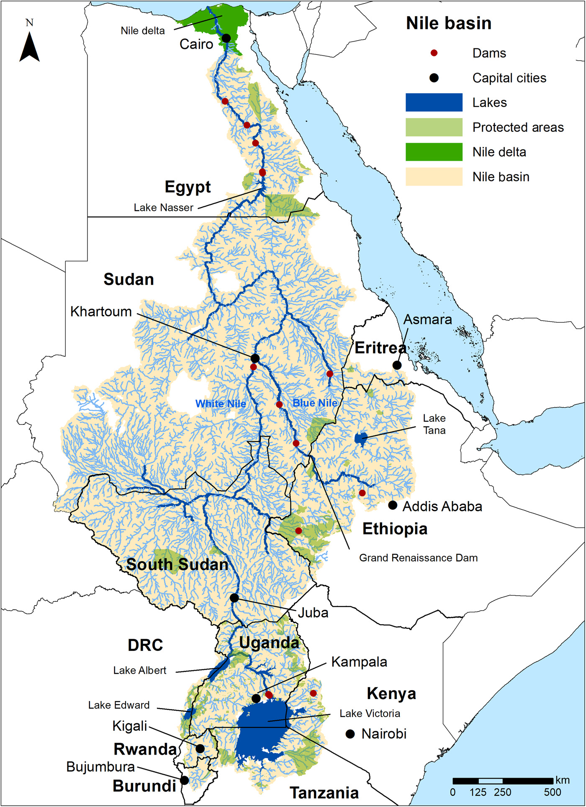
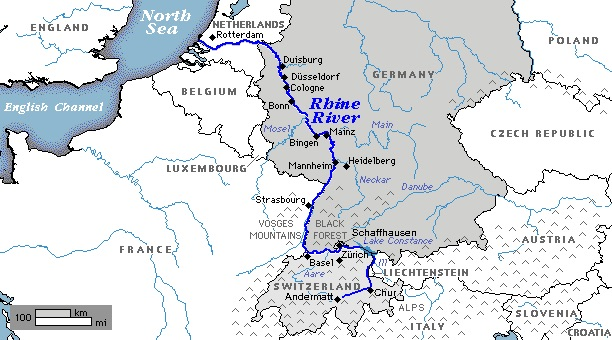

## 3,000 Years

There’s a reason Ancient Egypt endured for over three thousand years, while other 'cradles of civilization' rose and fell and rose again. Kemet[^kemet], as it was then known, had just the right mix of geography---impassable deserts to the west and east, and the fertile Nile River running through its heart. These features allowed it to prevail for millennia.

Deserts aren't too interesting. They take up residence, obviously, in places without water. But magnificent seas of nothing make for excellent walls against anyone foolish enough to try and cross them.

Rivers, by contrast, are whimsical creatures. They begin in mountains and highlands, before snaking down to lower elevations. They twist and fork, carving roads of water into the land before emptying into the sea. This erosion shapes valleys, creates deltas, and sometimes even redirects the course of the river itself.

It was along these waterways that the first civilizations took root. Rivers grew food in plenty to stimulate population growth; they also bore goods, peoples, and ideas across regions and between nations, while in wartime, they became vital for the movement of armies.

[^kemet]: Kemet means 'Black Land,' referring to the fertile soil of the Nile Valley. The surrounding deserts were called Deshret, the 'Red Land.'

## Prosperity

The rivers along which these early civilizations chose to settle flooded regularly---often once per year---and left behind fresh mantles of rich earth. This natural cycle provided fertile farmland and a surplus of food year after year.

Such reliable plenty allowed populations to expand, giving rise to non-agricultural professions and the ordering of society into high and low.

Then, the Sumerians introduced irrigation: the digging of ditches to channel floodwater beyond a river's natural reach, into fields the floods wouldn't normally touch. This technology spread quickly, vastly expanding fertile land while taming the floods, making them less liable to destroy homes and take lives.

This was the foundation of the first city-states. An emerging warrior caste did not need to work the fields; instead, they gathered in strongholds---hoarding grain---and became the first lords of the earth.

### Cradles of Civilization

We've spoken now of Egypt along the Nile, and the Sumerians in Mesopotamia, who possessed both the Tigris and the Euphrates.

<figure class="float-right">

<figcaption>The Nile River Basin</figcaption>
</figure>

At first glance, these two Bronze Age civilizations certainly seem alike: great rivers, ancient cities, written language. Yet Egypt endured as one kingdom while Mesopotamia passed through the hands of the Sumerians, the Akkadians, the Babylonians, the Assyrians, all of whom rose on the bones of their predecessors. Why such difference? The answer lies in the land.

Egypt was, simply put, a geographical fortress. Desert guarded it to the west, desert to the east, and cataracts[^cataracts] barred the Nile to the south. Invaders had few roads in, and those that existed were easily watched. A single river unified the realm; what the Nile touched, the Pharaoh ruled. As a result, Egypt remained Egypt for three thousand years.

Mesopotamia, meanwhile, suffered from unpredictable flooding which destroyed crops and brought droughts. To supplement, they herded sheep and goats. What's more, the region did not have the natural protections of Egypt. The land between the rivers lay open, with flat plains stretching to every horizon; there were no mountains or wastes to break an army's march. Empires rose fast there, and fell just as fast.

[^cataracts]: Cataracts are shallow stretches of the Nile broken by boulders and rapids, which served as convenient natural barriers to navigation and invasion.

## Exchange

Webs of roads stretch across most continents, but so too do vast networks of rivers. Together, they carried goods, peoples, and ideas across the world---and rivers, often being the faster choice[^railroads], were preferred when available.

Raw goods flowed to craftsmen and artisans; artisans moved manufactured goods to trading centers. These goods were then distributed through inter-city commerce or through wider international markets.

Through these same markets traveled institutions. Ideas were not adopted overnight. Rather, they had to *travel*---just like any good, and sometimes quite far---across land and over sea. They spread from their source to nearby regions, and from port cities, across the world.

[^railroads]: Until the Industrial Revolution. By the mid-nineteenth century, rail networks began to rival rivers for speed and reach (though rivers remained cheaper for bulk cargo).

### From the Alps to the North Sea

The Rhine has always been the lifeblood of Central Europe. It begins high in the Swiss Alps, travels a course across Germany, and empties into the North Sea via the lowlands of the Netherlands. For centuries, the river has been contested territory. Medieval princes squabbled over it. Napoleon's Continental System[^continental-system] depended on controlling its trade. By contrast, today's EU cooperates on Rhine navigation in ways that would have seemed impossible a century ago.

<figure>

<figcaption>The Rhine, from the Swiss Alps to the North Sea</figcaption>
</figure>

The Rhine didn't just carry goods, however; much more importantly, it carried *ideas*. It bore the communication and trade of innovation. Gutenberg was in Mainz, on the Rhine. His printed materials spread along the same trade routes that carried wine and cloth. The great banking houses---the Medici, the Fuggers[^fuggers]---used Rhine networks to expand their reach; bills of exchange[^bills-of-exchange] traveled the same waters as cargo. And when Luther published his pamphlets, they spread via those same routes. Frankfurt, on the Main and connected to the Rhine, was a major book fair hub. The Reformation followed the river.

[^continental-system]: Napoleon's trade embargo against Britain, designed to cripple the British economy by closing European ports to British goods. It largely backfired as Britain found new markets, while France and its allies were stuck not having the raw materials their industries needed.

[^fuggers]: A German banking dynasty based in Augsburg; arguably more powerful than the Medici in Northern Europe.

[^bills-of-exchange]: Financial instruments that allowed merchants to transfer money without moving physical coin.

## Conflict

Overland conquest is as much about logistics and control as it is about the battles themselves. An army that cannot eat cannot fight, and one that cannot move cannot win. Rivers solved both problems if a commander had been clever, or created them if he hadn't.

Holding river crossings and chokepoints can block enemies burdened by baggage trains; controlling a river entirely, however, means controlling *supply*. Whoever owns the water owns the war’s logistics. The free movement of arms, food, and manpower up and down rivers (and eventually, railroads) was almost always the deciding factor in prolonged campaigns.

### The Civil War

During the American Civil War, the Mississippi River was the primary conduit for north--south communication and commerce. Vicksburg sat at a crossroads where the Southern Railroad met the river. If the North could capture it, the Union would control the entire Mississippi and isolate the Confederate states west of the river from those in the east. To Confederate President Jefferson Davis, Vicksburg was "the nailhead that holds the South's two halves together." President Lincoln agreed, calling Vicksburg “the key,” and said “the war can never be brought to a close until that key is in our pocket.”

And so Grant[^grant] (in true Grant fashion) set out on a <a href="https://www.youtube.com/watch?v=1eSgimZ8GKQ" target="_blank">daring and unorthodox campaign</a> to capture the city, against the advice of his friends and all accepted military theories of war held by his superiors at the time.

<figure>

<figcaption>Grant's Vicksburg Campaign, 1863</figcaption>
</figure>

What followed was a string of bloody battles culminating in a 47-day siege. Starving, the defenders surrendered on July 4, 1863.

Grant's victory cut off Arkansas, Louisiana, and Texas from the rest of the Confederacy, splitting the South in two for the remainder of the war. When Port Hudson fell five days later, Lincoln declared that the Mississippi "again goes unvexed to the sea."

This unlikely win was a turning point for the war, and without it, the war would have been far longer and the outcome might have been different.

[^grant]: General Ulysses S. Grant, who needs no introduction.

## Conclusion

We started with Egypt, and perhaps we should end there too. Three thousand years is a long time to last---roughly the distance between us and the Trojan War, if it happened at all. The Nile made that possible: not just the water, but the *shape* of the land around it. A single river, a single kingdom, and deserts standing guard on either side.

The Mississippi didn't build a civilization, but it nearly broke one. Grant understood what Lincoln understood, even though they faced opposition from their own generals: control the river, split the South, win the war.

Rivers grew the first cities, carried ideas between nations, and decided the outcomes of wars. Three thousand years of an unwavering pattern, and likely not the last of it.

