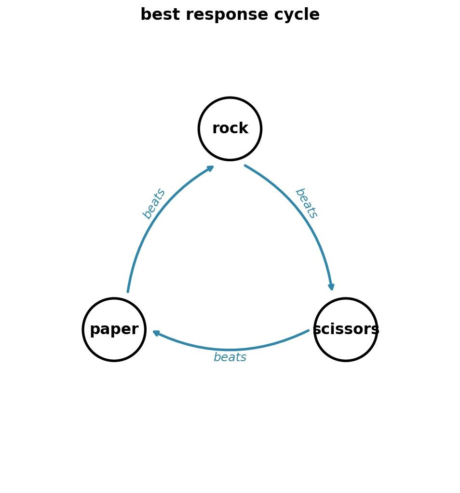

# Nash Equilibria Hide from Algorithms

Mathematics proves Nash equilibria must exist in every game, but computer science proves we can't find them efficiently.
2025-09-30
featured
math, game theory

When Uber and Lyft set prices in your neighborhood, their algorithms are competing in a game. Lower prices attract riders but hurt profits. Higher prices boost margins but lose customers. Both pricing algorithms update every few minutes, responding to one another.

This is an example of game theory in the real world, with millions of pricing decisions daily, no communication, and an equilibrium that must exist, but that nobody can compute efficiently.

## What's a Game?

Every finite game needs three things. Players $\mathcal{N} = \{1, 2, ..., n\}$ who make decisions. Each player $i$ has actions $A_i$---their available moves. And payoffs $u_i: A_1 \times ... \times A_n \to \mathbb{R}$ that map every possible combination of choices to a number representing how much each player values that outcome.

We can represent Rock-Paper-Scissors as:

<table class="payoff-matrix">
<tr><th></th><th>Rock</th><th>Paper</th><th>Scissors</th></tr>
<tr><td>Rock</td><td>0,0</td><td>-1,1</td><td>1,-1</td></tr>
<tr><td>Paper</td><td>1,-1</td><td>0,0</td><td>-1,1</td></tr>
<tr><td>Scissors</td><td>-1,1</td><td>1,-1</td><td>0,0</td></tr>
</table>

The numbers (0, 1, -1) are arbitrary. We could use (5, 10, 0) or any values that preserve the ordering. Winning beats tying beats losing, and the payoffs just encode these preferences.

## Pure vs. Mixed Strategies

We call a strategy pure if a player chooses a single action with certainty. In Rock-Paper-Scissors, "always play Rock" is a pure strategy. This works great until your opponent notices you're that predictable. If I always play Rock, you'll play Paper and always win.

So, what if I randomize instead?

A mixed strategy assigns probabilities to each pure action. Let $x_{i,a_i}$ denote the probability that player $i$ plays action $a_i$.

In general, where $x$ represents the mixed strategy profile of all players:
$$u_i(x) = \sum_{a_1 \in A_1} \cdots \sum_{a_n \in A_n} x_{1,a_1} \cdots x_{n,a_n} \cdot u_i(a_1, \ldots, a_n)$$

We calculate the expected payoff by considering every possible outcome of the game. For each outcome, we multiply the payoff by the probability it occurs (which is the product of all players' individual action probabilities), then sum everything up.

For example, if both players mix uniformly in Rock-Paper-Scissors with $x_{1,\text{Rock}} = x_{1,\text{Paper}} = x_{1,\text{Scissors}} = \frac{1}{3}$, each of the 9 outcomes occurs with probability $\frac{1}{9}$. The three wins, three losses, and three ties balance perfectly, giving expected payoff 0.

## Nash Equilibrium

A Nash equilibrium occurs when no player can unilaterally improve their payoff.

Formally, let $x_{-i}$ denote strategies of all players except $i$, and $X_i = \Delta(A_i)$ be the set of all probability distributions over player $i$'s actions. A strategy profile $x^* = (x_1^*, ..., x_n^*)$ is a Nash equilibrium when:

$$u_i(x_i^*, x_{-i}^*) \geq u_i(x_i, x_{-i}^*) \quad \forall x_i \in X_i, \forall i \in \mathcal{N}$$

In Rock-Paper-Scissors, the equilibrium has each player mixing uniformly: $x_1^* = x_2^* = (\frac{1}{3}, \frac{1}{3}, \frac{1}{3})$. No player can improve by deviating, as any other strategy against uniform mixing still yields expected payoff 0.

## Cycles

You might think the obvious approach would work: start somewhere, have each player switch to their best response, repeat until nobody wants to change. This is how we solve most optimization problems.

The best response operator selects the strategy that maximizes a player's payoff:
$$BestResponse_i(x_{-i}) = \arg\max_{x_i \in X_i} u_i(x_i, x_{-i})$$

But in Rock-Paper-Scissors, this approach loops forever. We know an equilibrium exists (playing each option with probability 1/3), but our algorithm just circles around it, never converging.

In the replicator dynamics below, trajectories orbit the Nash equilibrium (red star) without ever reaching it. Instead, the oscillations continue indefinitely:

## Nash's Existence Proof

Nash's insight was to draw from topology, not optimization. A fixed point of a function is any input that the function doesn't change: $f(x) = x$. Nash realized that if he could construct a function whose fixed points are exactly the Nash equilibria, then topology's fixed point theorems would guarantee equilibria exist.

Nash builds his function using regret: how much better player $i$ could do by switching to pure action $a_i$ while others keep their mixed strategies.
$$r_{i,a_i}(x) = u_i(a_i, x_{-i}) - u_i(x)$$
Positive regret means you wish you'd played that action.

Nash constructs a function $\phi: X \to X$ where $X = X_1 \times \cdots \times X_n$ is the product of all players' mixed strategy spaces. This map increases probabilities on actions with positive regret and decreases those without. Each component adjusts player $i$'s probability of playing action $a_i$:

$$\phi_{i,a_i}(x) = \frac{x_{i,a_i} + [r_{i,a_i}(x)]^+}{1 + \sum_{a_i' \in A_i} [r_{i,a_i'}(x)]^+}$$

where $[\cdot]^+ = \max(0, \cdot)$ takes only positive values. The numerator adds positive regret to the current probability; the denominator renormalizes so probabilities still sum to 1.

At Nash equilibrium, no regrets are positive, so $\phi(x^*) = x^*$ because nothing changes when there's nothing to improve. Conversely, any fixed point $\phi(x^*) = x^*$ must be a Nash equilibrium since no player has positive regret.

The function $\phi$ maps mixed strategies to mixed strategies continuously. [Brouwer's theorem](https://en.wikipedia.org/wiki/Brouwer_fixed-point_theorem) then guarantees a fixed point[^brouwer]. But the theorem is non-constructive: it proves equilibria must exist without telling us how to find them.

[^brouwer]: Brouwer's theorem says any continuous function from a compact convex set to itself must have a fixed point. Since mixed strategies form such a set and $\phi$ is continuous, a fixed point (Nash equilibrium) must exist. The catch is the theorem doesn't tell us how to find it.

## The Computational Complexity Gap

We know equilibria exist. Actually finding them splits sharply between tractable and intractable cases.

Zero-sum games, where one player's gain equals the other's loss at every outcome, yield to linear programming[^minimax]. The equilibrium computation reduces to:

$$
\begin{array}{ll}
\text{maximize} & v \\
\text{subject to} & \sum_{a_1 \in A_1} x_{1,a_1} \cdot u_1(a_1, a_2) \geq v \quad \forall a_2 \in A_2 \\
& \sum_{a_1 \in A_1} x_{1,a_1} = 1 \\
& x_{1,a_1} \geq 0
\end{array}
$$

where $x_{1,a_1}$ is player 1's probability of playing action $a_1$, and $u_1(a_1, a_2)$ is the payoff for player 1 when playing action $a_1$ against player 2's action $a_2$. This linear program solves in polynomial time.

[^minimax]: Von Neumann's minimax theorem (1928) showed that zero-sum games always have a well-defined value where both players' optimal strategies meet. We can use linear programming here because the theorem guarantees the LP will find the equilibrium.

General-sum games, where players' interests partially align, belong to PPAD-complete[^ppad].

[^ppad]: PPAD (Polynomial Parity Arguments on Directed graphs) is a complexity class for problems we know have solutions but can't find efficiently. Daskalakis et al. (2006) proved that computing Nash equilibria belongs to this class, meaning we likely can't solve them in polynomial time even though they must exist.

The mixed strategy space grows exponentially with actions. You might think we could settle for "close enough" solutions, but even $\varepsilon$-approximation remains PPAD-complete for $\varepsilon = 1/\text{poly}(n)$[^epsilon].

[^epsilon]: An $\varepsilon$-Nash equilibrium allows players to be slightly suboptimal. If $\varepsilon = 0.01$, no player could improve their payoff by more than 1% by switching strategies. You'd think this relaxation would make the problem easier, but it remains PPAD-complete for polynomially small values of $\varepsilon$.

Add an arbitrarily small non-zero-sum component to any zero-sum game and the complexity jumps from P to PPAD-complete. The slightest cooperation breaks our algorithms.

## Practical Workarounds in Different Fields

We can't compute exact Nash equilibria, so different fields have developed their own workarounds:

1. ML researchers training GANs face this directly. The generator tries to fool the discriminator while the discriminator tries to detect fakes, formalized as $\min_G \max_D V(D,G)$. Using simultaneous gradient descent-ascent, the dynamics may converge to local Nash equilibria or cycle indefinitely. In practice, adding learning rate decay and spectral normalization improves stability but doesn't guarantee convergence.

2. Economists design mechanisms that avoid equilibrium computation entirely. Second-price auctions (where the winner pays the second-highest bid) make truthful bidding optimal regardless of what others do. When each player has an obviously best move like this, nobody needs to compute equilibria.

3. Game AI uses computational brute force. AlphaGo self-plays millions of games to approximate Nash equilibria. For simpler games like [Pokemon Showdown 1v1](../winning-pokemon-showdown), the payoff matrices are small enough to solve exactly via linear programming. The price of guaranteed convergence is massive computation.

4. Correlated equilibria offer a polynomial-time alternative computable via linear programming. Think of a traffic light randomly assigning "go" to one direction. Following its recommendation is optimal for everyone. Unlike Nash equilibria which emerge from independent decisions, these need external coordination signals.

## Everywhere and Nowhere

Nash's [1951 existence proof](https://www.jstor.org/stable/1969529) using Brouwer's fixed-point theorem takes just two pages. The [2006 PPAD-completeness proof](https://doi.org/10.1137/070699652) that finding equilibria is computationally hard runs over 100 pages, using a reduction from 3-SAT through intermediate problems like 3D-Sperner and arithmetic circuits.

Two pages prove equilibria exist in every market mechanism, every network protocol, every adversarial learning system. A hundred pages prove we can't find them efficiently. The mathematics guarantees they're there, while computer science proves they're out of reach[^thanks].

Every GAN that refuses to converge, every pricing algorithm that oscillates, every market that behaves unpredictably is seeking an equilibrium we can't compute. We build workarounds and approximations, but the real equilibria remain hidden, determining outcomes from spaces too large to search. They exist, as proven. We observe their effects daily. We just can't find them.

[^thanks]: Thanks to Prof. Manolis Vlatakis and his grad course "Game Theory, Optimization, and Learning" at UW-Madison, which I took in my third year of undergrad. I had a lot of fun learning all of this.
