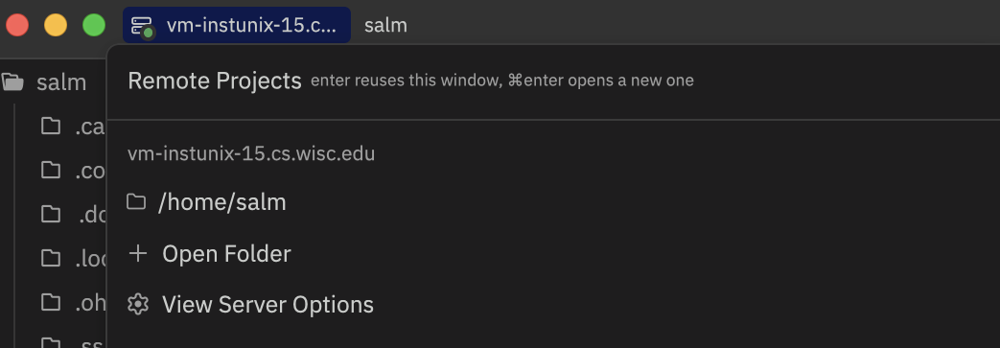

## Shell Startup Output

I do work on UW-Madison's CS lab machines over SSH. VSCode handles this fine with its Remote SSH extension, but I've been using [Zed](https://zed.dev) and wanted the same workflow there. Getting it working required fixing three things, starting with this one.

Zed's remote architecture splits the editor into <a href="https://zed.dev/docs/remote-development" target="_blank">a local UI and a remote backend</a>. When you connect, Zed SSHes in and starts a `zed-remote-server` binary on the remote machine. The two halves communicate over the SSH channel itself.

So anything your shell prints during startup corrupts the protocol. A Powerlevel10k instant prompt, a conda greeting, an `echo` in your rc file, etc. Zed hangs at "Starting proxy..." and never connects.

You fix this by adding `[[ -o interactive ]] || return 0` as the very first line of your remote `~/.bashrc`. If your remote shell is zsh instead, put it in `~/.zshrc`.[^1] This makes non-interactive shells exit before printing anything.

Use `return 0`, not bare `return`. A bare `return` propagates exit code 1 from the failed interactive test, and Zed treats that as a startup failure.

[^1]: The CSL machines default to bash. I installed zsh on mine a couple years ago, but most people will be editing `.bashrc`. Check with `echo $SHELL` on the remote if you're not sure.

## Unix Sockets on AFS

After fixing the shell issue, Zed connected but immediately crashed with "Client exited with exit_code 1." This is an improvement.

I looked at Zed's logs (`Cmd+Shift+P` and click "zed: open log") and found the problem. Zed creates [Unix domain sockets](https://en.wikipedia.org/wiki/Unix_domain_socket) in `~/.local/share/zed/server_state/` for inter-process communication. The CS lab home directories live on AFS[^2], and AFS doesn't support them.

You can fix this by symlinking Zed's data directory to a local filesystem. Only the `server_state` subdirectory strictly needs it, but symlinking the whole thing is simpler. Run these on the remote to move any existing Zed data aside and point `~/.local/share/zed` at `/tmp` instead:

```bash
mv ~/.local/share/zed ~/.local/share/zed.bak 2>/dev/null
mkdir -p ~/.local/share /tmp/zed-$USER
ln -s /tmp/zed-$USER ~/.local/share/zed
cp -r ~/.local/share/zed.bak/* /tmp/zed-$USER/ 2>/dev/null
```

`/tmp` gets cleared on reboot, so you'll want `mkdir -p /tmp/zed-$USER` in your rc file too.

[^2]: [AFS](https://en.wikipedia.org/wiki/Andrew_File_System) (Andrew File System) is a distributed network filesystem common at universities. It handles regular files fine but doesn't support Unix sockets or `flock`. VSCode's Remote SSH actually hits a similar AFS problem, but with file locks instead of sockets. Same class of fix though: redirect to `/tmp`.

## The Load Balancer

After fixing both of those, I was still getting the same exit code.

The hostname `best-linux.cs.wisc.edu` is a DNS load balancer that routes each connection to a different physical machine[^vm]. Zed makes several SSH connections during setup (platform discovery, binary upload, server start, protocol handshake) and each one can land on a different host. `/tmp` is per-machine, so the binary ends up on one box and the sockets on another.

You fix this by connecting to a specific machine instead of the load balancer. SSH into `best-linux` once, run `hostname`, and note the machine you land on. Use that everywhere.[^load]

[^vm]: Well, VMs nowadays. The old physical labs (rockhopper, royal, and the rest in the CS building) are empty now. RIP computer labs :(

[^load]: The specific machine doesn't matter. You just need every connection to hit the same one.

## The Working Configuration

All together:

**`~/.ssh/config`**
```
Host uw
    HostName best-linux.cs.wisc.edu
    User your-cs-login

# Zed needs a specific machine, in this case vm-instunix-15
Host uw-zed
    HostName vm-instunix-15.cs.wisc.edu
    User your-cs-login

Host *
    ControlMaster auto
    ControlPath ~/.ssh/%r@%h:%p
    ControlPersist 300s
```

The `ControlMaster` block is optional. Some convenient bonus config. It reuses SSH connections so you don't have to re-authenticate every time.

**`~/.config/zed/settings.json`**
```json
{
  "ssh_connections": [
    {
      "host": "vm-instunix-15.cs.wisc.edu",
      "username": "your-cs-login",
      "projects": [
        { "paths": ["/home/your-cs-login"] }
      ]
    }
  ]
}
```

**Remote `~/.bashrc`** (first lines):
```bash
[[ -o interactive ]] || return 0

mkdir -p /tmp/zed-$USER

# ... rest of your config
```

Connect via the Command palette (open with `Cmd+Shift+P`) and click "project: open remote", or `zed ssh://user@vm-instunix-15.cs.wisc.edu/home/user` (if you enabled the Zed CLI).

If the remote machine can't reach GitHub to download the server binary, add `"upload_binary_over_ssh": true` to the connection config. Zed will download the ~90MB binary locally and SCP it over.[^3]

[^3]: The binary lives at `~/.zed_server/` on the remote, separate from `~/.local/share/zed/`. AFS handles regular files fine, so this path doesn't need the `/tmp` treatment.

## That's It



Once configured, it works well! You get Zed's [Tree-sitter](https://tree-sitter.github.io/tree-sitter/) highlighting locally and language servers running on the remote, and the whole thing is snappy.

Fair warning though: Zed's error messages are not ideal. For example, "Client exited with exit_code 1" covers about four different failure modes. If you run into trouble, check Zed's log locally and `~/.local/share/zed/logs/server-setup-*.log` on the remote. Between the two you'll find the real error. I certainly spent more time reading logs than writing config.
