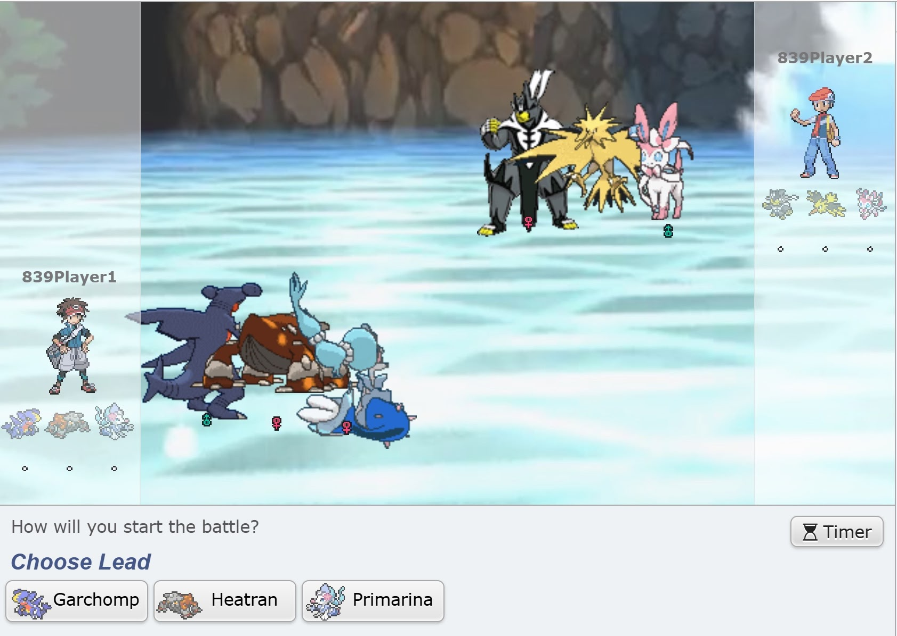
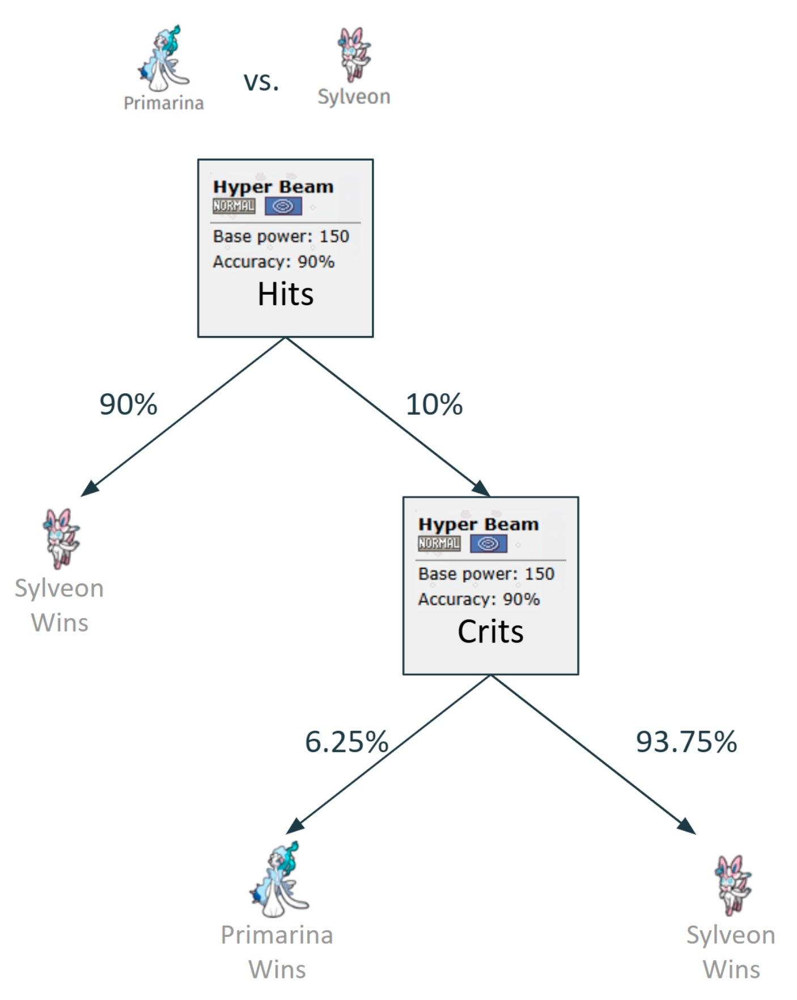
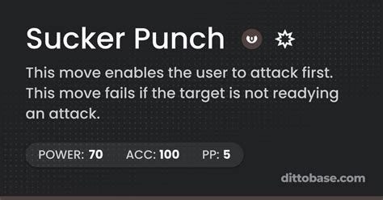
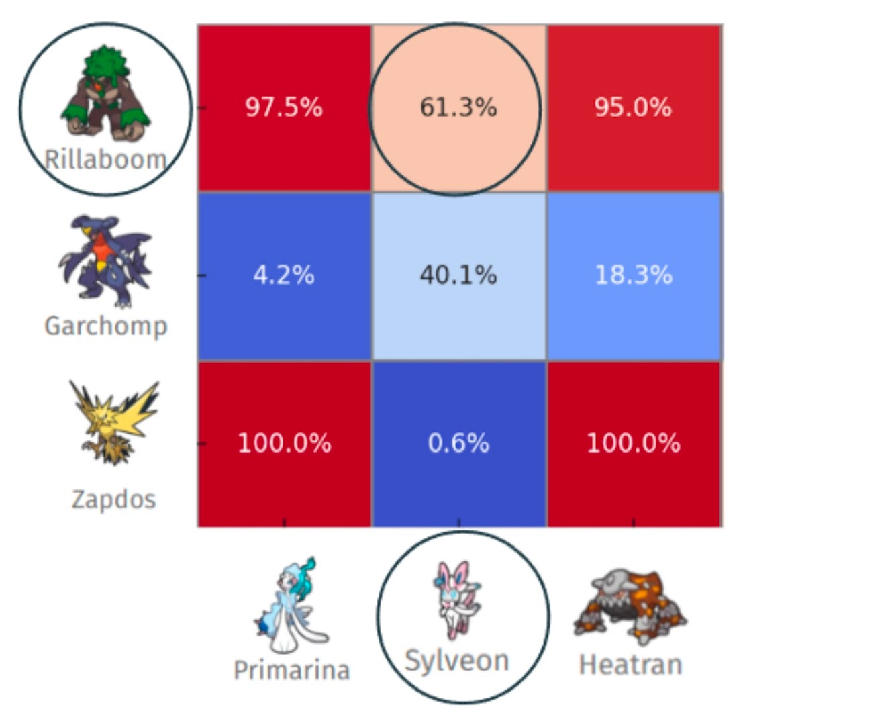

# Winning Pokemon Showdown (w/ Game Theory!)
<div class="description">
We analyzed Pokémon Showdown battles using game theory and found the mathematically optimal strategies. And they perfectly matched what our 5000+ hour expert already knew!
<span class="date-info"><span class="date">2025-05-11</span></span>
</div>

## Premise
In [Pokémon Showdown](https://pokemonshowdown.com/), you build a team of Pokémon and battle. In the 1v1 format, you bring a team of three Pokémon and choose one for each battle—this simplified format lets us focus on pure strategic decision-making without the complexity of switching mid-battle that defines 6v6 play. A game consists of a "choosing" phase (left) and a "battling" phase (right):

<table style="margin: 0 auto; border-collapse: collapse;">
  <tr>
    <td style="padding: 10px; text-align: center;">
      
    </td>
    <td style="padding: 10px; text-align: center;">
      
    </td>
  </tr>
</table>

When a player's Pokemon's HP reaches 0, the other player wins:


## The Seven Pokemon We Analyzed
For our project, my friends and I focused on seven of the most commonly used Pokémon in the January 2021 Pokémon Showdown 1v1 leaderboard:


<p style="text-align: center; font-style: italic; margin-top: 10px;">
  Primarina, Sylveon, Heatran, Urshifu, Rillaboom, Garchomp, and Zapdos
</p>

Each Pokémon has its own unique typing, movesets, and stats that create diverse strategic matchups. For consistency, we used the most popular standard moveset for each Pokémon according to [Smogon's Strategy Dex](https://www.smogon.com/dex/ss/pokemon/).

## Our Approach
This is where Game Theory comes into play. Pokémon battles are naturally [zero-sum games](https://en.wikipedia.org/wiki/Zero-sum_game): one player's win is the other player's loss. Each turn, both players select moves simultaneously, which creates an interesting strategic dynamic perfect for game theory analysis.

We modeled these battles in two key stages:

## The Battling Phase (Finding Optimal Move Strategies)

First, we needed to understand how each Pokémon matchup would play out when both players use optimal strategies. This required us to create turn-based payoff matrices for each possible matchup (a [normal form game](https://en.wikipedia.org/wiki/Normal-form_game) representation of the strategic interactions), calculating the expected damage and effects of every possible move combination with Showdown's [Pokémon Damage Calculator](https://calc.pokemonshowdown.com/).


<p style="text-align: center; font-style: italic; margin-top: 10px;">
  This payoff matrix shows damage ranges between Garchomp and Sylveon's moves
</p>

Pokémon battles have numerous random elements: move accuracy, critical hits, and damage ranges. To handle this, we built [expectimax trees](https://inst.eecs.berkeley.edu/~cs188/textbook/games/expectimax.html) (a variant of [extensive form games](https://en.wikipedia.org/wiki/Extensive-form_game)) that calculated the expected outcome of each decision.


<p style="text-align: center; font-style: italic; margin-top: 10px;">
  Example of a battle decision tree showing Hyper Beam outcomes between Primarina and Sylveon
</p>

Some moves like *Sucker Punch* (which only works if the opponent uses an attacking move) create rock-paper-scissors style mind games that required [mixed strategy Nash equilibria](https://en.wikipedia.org/wiki/Strategy_(game_theory)#Mixed_strategy). For particularly complex scenarios, we put together a reinforcement learning algorithm to discover optimal mixed strategies that wouldn't be obvious through direct calculation.


<p style="text-align: center; font-style: italic; margin-top: 10px;">
   Sucker Punch move
</p>

### The Math Behind Nash Equilibrium

Here's a simplified example of how we computed Nash equilibrium strategies for a zero-sum game using [linear programming](https://en.wikipedia.org/wiki/Linear_programming):

```python
def compute_nash_equilibrium(payoff_matrix):
    """
    Compute the Nash equilibrium for a zero-sum game using linear programming.

    Args:
        payoff_matrix: A numpy array where A[i,j] is the payoff when player 1
                      plays strategy i and player 2 plays strategy j

    Returns:
        tuple (p1_strategy, p2_strategy, value) containing optimal mixed strategies
    """
    num_rows, num_cols = payoff_matrix.shape

    # Player 1's linear program
    c = np.zeros(num_rows + 1)
    c[-1] = -1  # maximize v (game value)

    # Constraints ensuring expected payoff is at least v against any opponent strategy
    A_ub = np.zeros((num_cols, num_rows + 1))
    for j in range(num_cols):
        A_ub[j, :-1] = -payoff_matrix[:, j]
        A_ub[j, -1] = 1
    b_ub = np.zeros(num_cols)

    # Constraint that probabilities sum to 1
    A_eq = np.zeros((1, num_rows + 1))
    A_eq[0, :-1] = 1
    b_eq = np.ones(1)

    bounds = [(0, 1) for _ in range(num_rows)] + [(None, None)]

    # Solve the linear program
    res1 = linprog(c, A_ub=A_ub, b_ub=b_ub, A_eq=A_eq, b_eq=b_eq,
                   bounds=bounds, method='highs')

    # Extract player 1's strategy and game value
    p1_strategy = res1.x[:-1]
    v = -res1.fun

    # Player 2's linear program (omitted for brevity)
    # ...

    return p1_strategy, p2_strategy, v
```

The code above computes the mathematically optimal mixed strategy for each player. For example, in the *Rillaboom vs. Urshifu* matchup, this approach identified that the optimal strategy for Urshifu in turns 3+ was to use a perfectly balanced mixed strategy of *Sucker Punch* 50% of the time and *Wicked Blow* 50% of the time, while Rillaboom should adaptively choose between *Swords Dance* and *Grassy Glide* based on battle conditions (a result that expert players had intuitively discovered through experience!)

## The Choosing Phase (Team Selection Strategies)

Once we solved the optimal move strategies for individual battles, we could analyze the team selection meta-game. After simulating over 1 million battles for each possible matchup, we created a comprehensive payoff matrix of win probabilities:


<p style="text-align: center; font-style: italic; margin-top: 10px;">
  Matchup win probability matrix
</p>

Using this matrix, we could then solve for Nash equilibria in the team selection phase, applying [minimax theorem](https://en.wikipedia.org/wiki/Minimax_theorem) principles.

### Analyzing Team Performance

We analyzed all 35 possible team combinations using our 7 selected Pokémon, evaluating a total of 595 unique matchups. Here's how we calculated the average win rates:

```python
def analyze_matchup(team_a, team_b, win_probabilities):
    """
    Analyze a Pokémon matchup and return the game value (win probability for team_a).
    """
    # Create payoff matrix where A[i,j] = win probability when Pokémon i faces Pokémon j
    payoff_matrix = create_payoff_matrix(team_a, team_b, win_probabilities)

    # Compute Nash equilibrium
    _, _, game_value = compute_nash_equilibrium(payoff_matrix)

    return game_value

# Calculate win rates for all teams
team_results = {}
for team in all_team_combinations:
    total_win_rate = 0.0
    total_matchups = 0

    for opponent_team in all_team_combinations:
        if team != opponent_team:
            win_rate = analyze_matchup(team, opponent_team, win_probabilities)
            total_win_rate += win_rate
            total_matchups += 1

    team_results[team] = total_win_rate / total_matchups

# Sort teams by average win rate
best_teams = sorted(team_results.items(), key=lambda x: x[1], reverse=True)
```


<p style="text-align: center; font-style: italic; margin-top: 10px;">
  Team performance ranking based on average win rates
</p>

## Key Findings

Our analysis revealed that the strongest team composition was Heatran, Sylveon, and Zapdos with a solid 62.4% average win rate across all matchups! The combination of Garchomp, Heatran, and Urshifu struggled significantly with just a 29.7% win rate. Among individual Pokémon, Sylveon proved to be the most versatile performer, maintaining a 55.3% win rate across all team compositions.


<p style="text-align: center; font-style: italic; margin-top: 10px;">
  Best and worst performing Pokémon based on Nash equilibrium calculations
</p>

Teams containing Sylveon and Zapdos generally performed well in our simulations, while teams pairing Heatran with Urshifu tended to underperform. The most successful teams generally featured complementary types that effectively covered each other's weaknesses.

## Cool Matchup Examples

### Heatran vs. Garchomp

One of the simpler matchups we analyzed was *Heatran vs. Garchomp*. Despite Garchomp's fearsome reputation, our models determined Heatran should win 81.7% of the time when both players use optimal strategies.


<p style="text-align: center; font-style: italic; margin-top: 10px;">
  Battle setup and outcome for Heatran vs. Garchomp
</p>

The optimal strategy for Heatran is to use *Will-O-Wisp* on turn 1 (to burn and halve Garchomp's attack), then switch to *Dragon Pulse* for subsequent turns. Garchomp should use *Stone Edge* despite its 80% accuracy, as it offers the highest expected damage output.

### Rillaboom vs. Urshifu

The strategic mind games in the *Rillaboom vs. Urshifu* were where things began to get interesting. *Sucker Punch*, which only works against attacking moves, creates a complicated decision matrix where neither Pokémon can rely on a single dominant strategy.


<p style="text-align: center; font-style: italic; margin-top: 10px;">
   Payoff matrix for Rillaboom vs. Urshifu involving the move Sucker Punch
</p>

Crunching the numbers reveals Urshifu should employ a perfect 50/50 split between Sucker Punch and Wicked Blow after turn 2, while Rillaboom adapts based on battle conditions:


<p style="text-align: center; font-style: italic; margin-top: 10px;">
   Battle setup and outcome for Rillaboom vs. Urshifu
</p>

Despite optimal play from both sides, Rillaboom maintains a 69.5% win rate -- at the end of the day, some matchup just favor certain Pokémon regardless of strategic choices.

## An Interesting Convergence

Jake, our Pokémon expert (with over 5000 hours?!), predicted almost identical strategies to our mathematical model. This convergence demonstrates that formal game theory often confirms what skilled players discover through experience. In other words, the mathematically optimal strategy frequently matches strategies already employed by those with deep game understanding.

## Nash Equilibria in Team Selection
Some team matchups resulted in [pure Nash equilibria](https://en.wikipedia.org/wiki/Strategy_(game_theory)#Pure_and_mixed_strategies) with dominant strategies:


<p style="text-align: center; font-style: italic; margin-top: 10px;">
  Example of a pure Nash equilibrium in team selection
</p>

While others required mixed strategies, creating a Rock-Paper-Scissors dynamic:


<p style="text-align: center; font-style: italic; margin-top: 10px;">
  Example of a mixed Nash equilibrium in team selection
</p>

Interestingly, when we analyzed the direct matchup between our best team (Heatran, Sylveon, Zapdos) and worst team (Garchomp, Heatran, Urshifu), the win rate was only 50.5% in favor of the best team. We believe this makes sense, because team composition effectiveness depends greatly on the broader metagame, not simply individual matchups.[^3]

[^3]: This demonstrates the "[intransitivity](https://en.wikipedia.org/wiki/Intransitivity)" property in Pokémon team selection -- just because Team A beats Team B and Team B beats Team C doesn't necessarily mean Team A beats Team C. This creates a complex competitive landscape where no single team dominates everything. This situation is also similar to the [Condorcet paradox](https://en.wikipedia.org/wiki/Condorcet_paradox) in social choice theory.

## Challenges & Limitations

Our biggest challenge was handling Pokémon's inherent randomness. With 16 possible damage rolls per move and battles lasting multiple turns, we needed high-iteration simulations rather than pure expectimax trees to get reliable win rates.[^1]

We also faced balance issues: initially, Rillaboom dominated with no bad matchups (worst case: 50% win rate against itself), creating boring results. Adding Zapdos and Garchomp created a more interesting strategic landscape. This led to boring games with repetitive outcomes, so we added Zapdos and Garchomp to make games more even and interesting to model.

One limitation was our decision to use fixed movesets. In competitive play, moveset variation is crucial, with Pokémon like Iron Valiant ([currently #1 in 1v1](https://www.smogon.com/stats/)) being powerful precisely because of its unpredictable moveset options.[^2]

[^1]: Our final solution involved running over 1 million simulations for each matchup to accurately account for all possible random outcomes. This was computationally intensive but necessary to get statistically significant results.

[^2]: While we used the standard Smogon Strategy Dex movesets for consistency, competitive players often use surprise movesets to gain an edge. This "meta-gaming" aspect creates another layer of game theory that could be explored in future work.

## Conclusion & Future Work

This project successfully modeled optimal strategies in Pokémon battles using game theory, revealing team compositions and move selections that aligned surprisingly well with expert players' intuitions.

The computational complexity of our approach grows exponentially with each additional Pokémon we analyze. With just 7 Pokémon, we had to evaluate 595 unique matchups. Expanding to 50 Pokémon would require analyzing over 230,000 team combinations and millions of potential matchups. The mathematics becomes daunting: for n Pokémon, we'd need to analyze approximately O(n² + (n choose 3)²) matchups when accounting for both individual and team battles. The combinatorial explosion in Pokémon battles creates a mathematical sweet spot where optimal strategies remain theoretically solvable yet practically challenging to discover due to their enormous state space. That said, it *is* possible! (We might just have to rewrite our Python to Rust...)

Looking ahead, we'd like to expand beyond our 7 Pokémon to analyze the top 50 in the current meta. This expansion would involve incorporating [Bayesian game](https://en.wikipedia.org/wiki/Bayesian_game) principles to account for incomplete information (like unknown opponent movesets) and [stochastic (Markov) game](https://en.wikipedia.org/wiki/Stochastic_game) modeling to handle the probabilistic nature of Pokémon battles. We also aim to incorporate moveset variations into our model and tackle the substantially more complex 6v6 format with switching (5 switch options + the 4 move options on each turn).

Our [paper](https://github.com/nicosalm/pokemon-expectimax/blob/main/report/CS839_FinalReport_PokemonBattles.pdf) and [code](https://github.com/nicosalm/pokemon-expectimax/tree/main) are available on GitHub if you'd like to explore our methods or build upon our work. Special thanks to Professor Manolis Vlatakis for being an encouraging mentor through this process! This project spawned out of his graduate class at UW-Madison: Game Theory, Optimization, and Learning (in Spring '25).
