## Premise
In [Pokémon Showdown](https://pokemonshowdown.com/), you build a team of Pokémon and battle. In the 1v1 format, you bring three Pokémon and choose one for each battle. No switching allowed, so it's pure strategic decision-making. A game has two phases: choosing your Pokémon (left) and battling (right):

<div style="display: flex; justify-content: center; gap: 0.5rem;">
  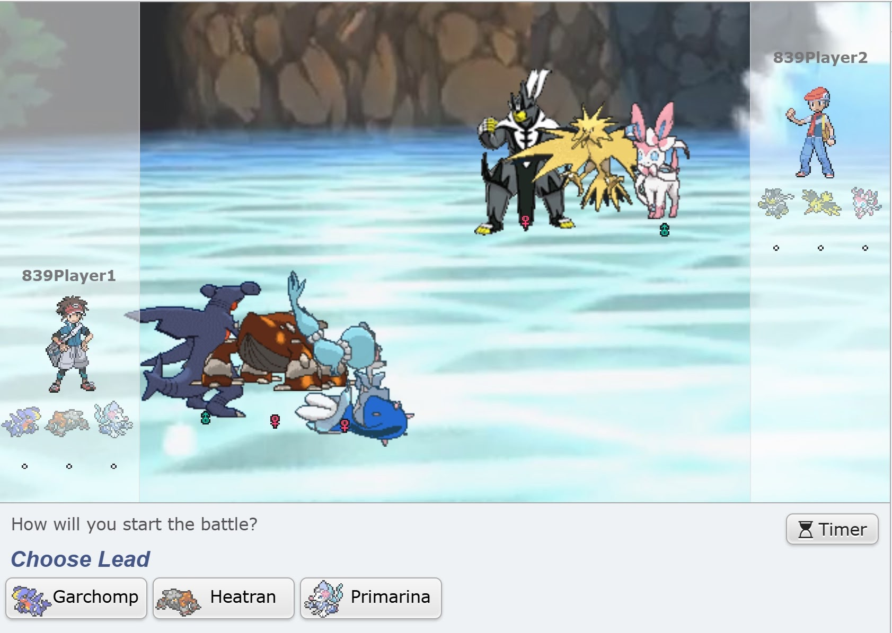
  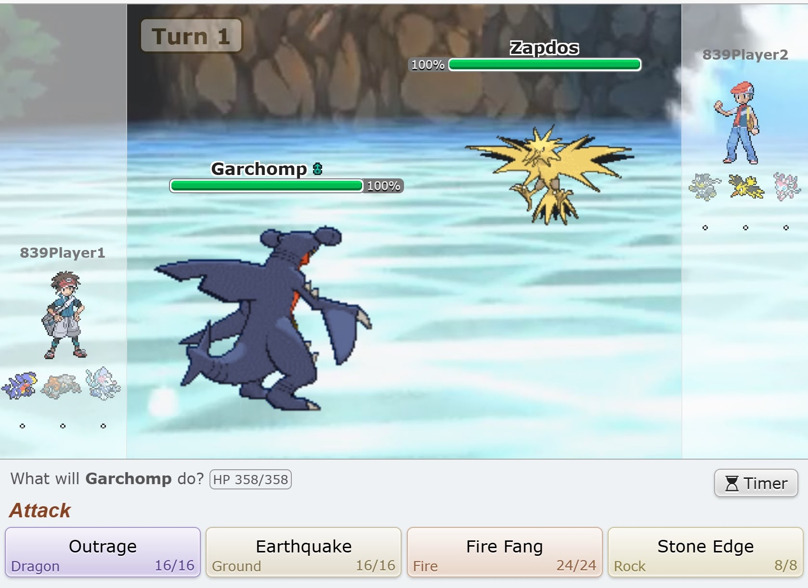
</div>

When a player's Pokemon's <abbr title="Hitpoints">HP</abbr> reaches 0, the other player wins:

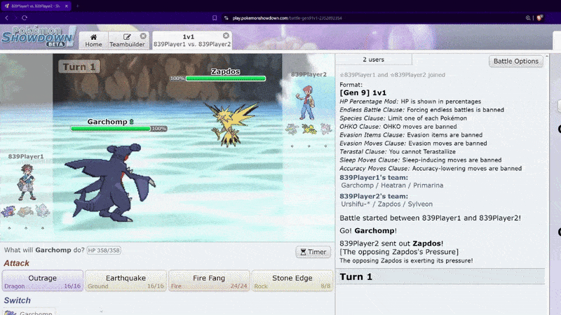

## The Seven Pokemon We Analyzed
For our project, my friends and I focused on seven of the most commonly used Pokémon in the January 2021 Pokémon Showdown 1v1 leaderboard:

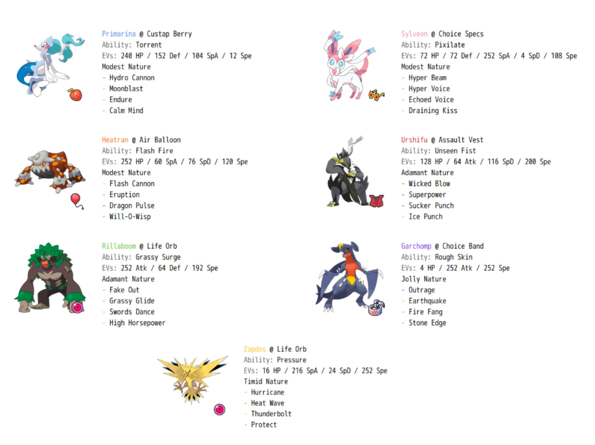

Each Pokémon has its own unique typing, movesets, and stats that create diverse strategic matchups. For consistency, we used the most popular standard moveset for each Pokémon according to [Smogon's Strategy Dex](https://www.smogon.com/dex/ss/pokemon/).

## Our Approach
Pokémon battles are [zero-sum games](https://en.wikipedia.org/wiki/Zero-sum_game): one player's win is the other's loss. Both players select moves simultaneously each turn, creating the exact type of strategic interaction game theory was built to solve. Crucially, zero-sum games are one of the few cases where we can efficiently compute Nash equilibria, unlike the general games that resist computation.

We modeled these battles in two key stages:

## The Battling Phase (Finding Optimal Move Strategies)

First, we needed to understand how each Pokémon matchup plays out when both players use optimal strategies. We built turn-based payoff matrices for each possible matchup, calculating expected damage and effects for every move combination using Showdown's [Pokémon Damage Calculator](https://calc.pokemonshowdown.com/).

<figure style="margin: var(--spacing-medium) auto; text-align: center;">

<figcaption>Damage ranges between Garchomp and Sylveon's moves</figcaption>
</figure>

Pokémon battles have random elements: move accuracy, critical hits, and damage ranges. We handled these with [expectimax trees](https://inst.eecs.berkeley.edu/~cs188/textbook/games/expectimax.html) that calculate expected outcomes for each decision.

<figure style="margin: var(--spacing-medium) auto; text-align: center;">
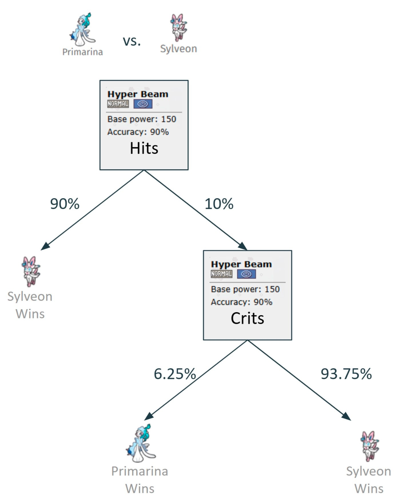
<figcaption>Battle decision tree showing Hyper Beam outcomes between Primarina and Sylveon</figcaption>
</figure>

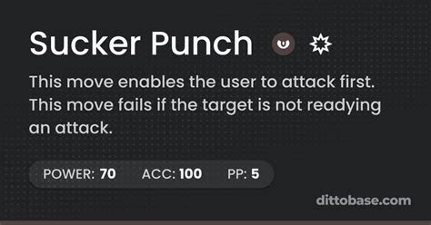

Some moves like *Sucker Punch* (which only works if the opponent uses an attacking move) create rock-paper-scissors style mind games that require [mixed strategy Nash equilibria](https://en.wikipedia.org/wiki/Strategy_(game_theory)#Mixed_strategy). When the payoff matrices got too complex, we turned to reinforcement learning to find strategies we'd never spot by hand.

<div style="clear: both;"></div>

### The Math Behind Nash Equilibrium

Pokemon battles are zero-sum games (one trainer's win is the other's loss), which means we can actually compute exact Nash equilibria efficiently using linear programming. This tractability is special to zero-sum games:

```python
def compute_nash_equilibrium(payoff_matrix):
    """
    Compute Nash equilibrium for zero-sum game via linear programming.
    payoff_matrix[i,j] = payoff when P1 plays i, P2 plays j
    Returns: (p1_strategy, p2_strategy, game_value)
    """
    num_rows, num_cols = payoff_matrix.shape

    # Set up Player 1's LP
    c = np.zeros(num_rows + 1)
    c[-1] = -1  # maximize game value v

    # Expected payoff >= v against any P2 strategy
    A_ub = np.zeros((num_cols, num_rows + 1))
    for j in range(num_cols):
        A_ub[j, :-1] = -payoff_matrix[:, j]
        A_ub[j, -1] = 1
    b_ub = np.zeros(num_cols)

    # Probabilities sum to 1
    A_eq = np.zeros((1, num_rows + 1))
    A_eq[0, :-1] = 1
    b_eq = np.ones(1)

    bounds = [(0, 1) for _ in range(num_rows)] + [(None, None)]

    # Solve
    res1 = linprog(c, A_ub=A_ub, b_ub=b_ub, A_eq=A_eq, b_eq=b_eq,
                   bounds=bounds, method='highs')

    p1_strategy = res1.x[:-1]
    v = -res1.fun

    # Player 2's LP omitted...
    return p1_strategy, p2_strategy, v
```

The code above computes the mathematically optimal mixed strategy for each player. In the *Rillaboom vs. Urshifu* matchup, the math confirmed what top players already knew: Urshifu should mix *Sucker Punch* and *Wicked Blow* exactly 50/50 in late turns, while Rillaboom adapts between *Swords Dance* and *Grassy Glide* based on the situation.

## The Choosing Phase (Team Selection Strategies)

With optimal move strategies worked out for individual battles, we turned to the team selection meta-game. After simulating over 1 million battles for each possible matchup, we built a payoff matrix of win probabilities:

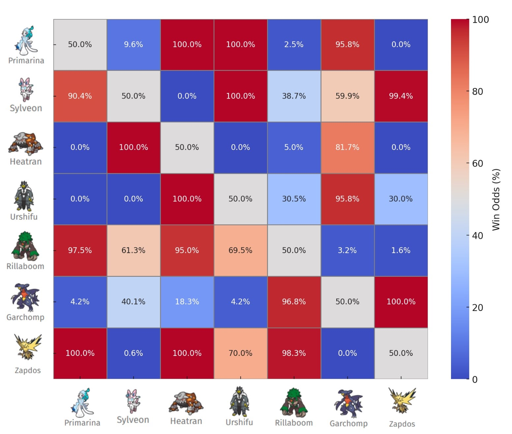

Using this matrix, we could then solve for the optimal team selection strategies.

### Analyzing Team Performance

We analyzed all 35 possible team combinations using our 7 selected Pokémon, evaluating a total of 595 unique matchups. Here's how we calculated the average win rates:

```python
def analyze_matchup(team_a, team_b, win_probabilities):
    """Calculate team_a's win probability against team_b"""
    payoff_matrix = create_payoff_matrix(team_a, team_b, win_probabilities)
    _, _, game_value = compute_nash_equilibrium(payoff_matrix)
    return game_value

# Calculate win rates
team_results = {}
for team in all_team_combinations:
    total_win_rate = 0.0
    total_matchups = 0

    for opponent_team in all_team_combinations:
        if team != opponent_team:
            win_rate = analyze_matchup(team, opponent_team, win_probabilities)
            total_win_rate += win_rate
            total_matchups += 1

    team_results[team] = total_win_rate / total_matchups

# Sort teams by average win rate
best_teams = sorted(team_results.items(), key=lambda x: x[1], reverse=True)
```

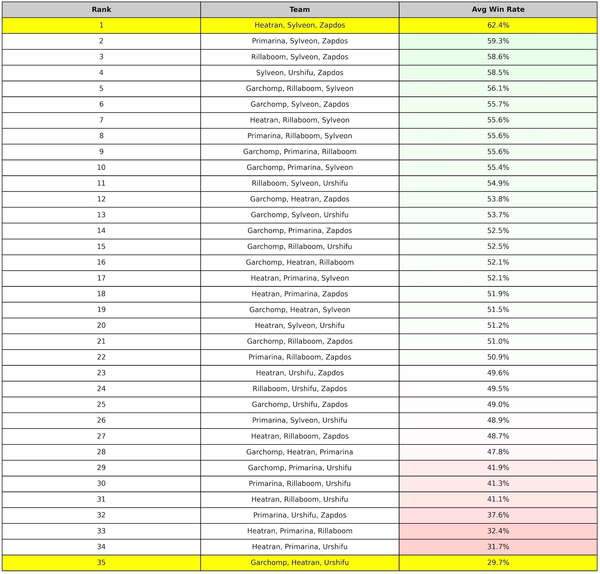

## Key Findings

The strongest team turned out to be Heatran, Sylveon, and Zapdos with a 62.4% average win rate across all matchups. Garchomp, Heatran, and Urshifu together struggled at just 29.7%. Sylveon was the MVP, maintaining a 55.3% win rate across all team compositions.

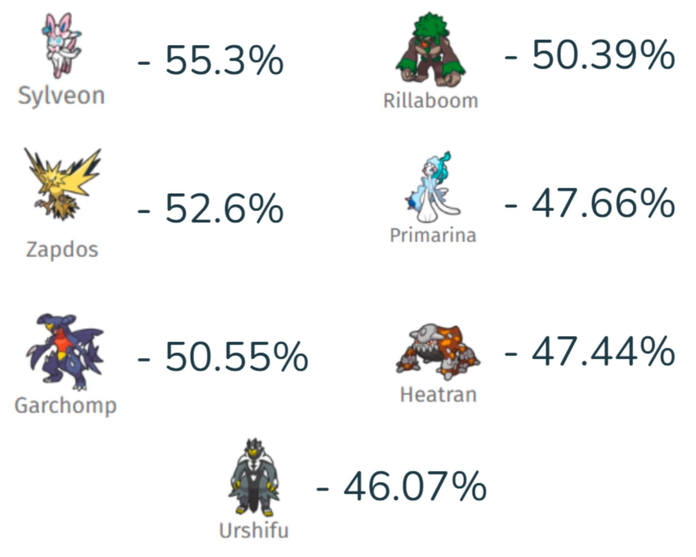

Teams with Sylveon and Zapdos consistently won in our simulations. Pairing Heatran with Urshifu was a recipe for disaster.

## Cool Matchup Examples

### Heatran vs. Garchomp


*Heatran vs. Garchomp* was one of the simpler matchups. Despite Garchomp's fearsome reputation, Heatran wins 81.7% of the time when both players play optimally. Heatran should open with *Will-O-Wisp* to burn and halve Garchomp's attack, then spam *Dragon Pulse*. Garchomp's best bet is *Stone Edge* despite its 80% accuracy.

<div style="clear: both;"></div>

### Rillaboom vs. Urshifu

*Rillaboom vs. Urshifu* is where the mind games get real. *Sucker Punch* only works against attacking moves, so neither Pokémon has a dominant strategy. The math says Urshifu should mix Sucker Punch and Wicked Blow 50/50 after turn 2, while Rillaboom adapts to the situation. Even with perfect play from both sides, Rillaboom wins 69.5% of the time.

<div style="display: flex; gap: 1rem; justify-content: center; flex-wrap: wrap; margin: var(--spacing-medium) 0;">
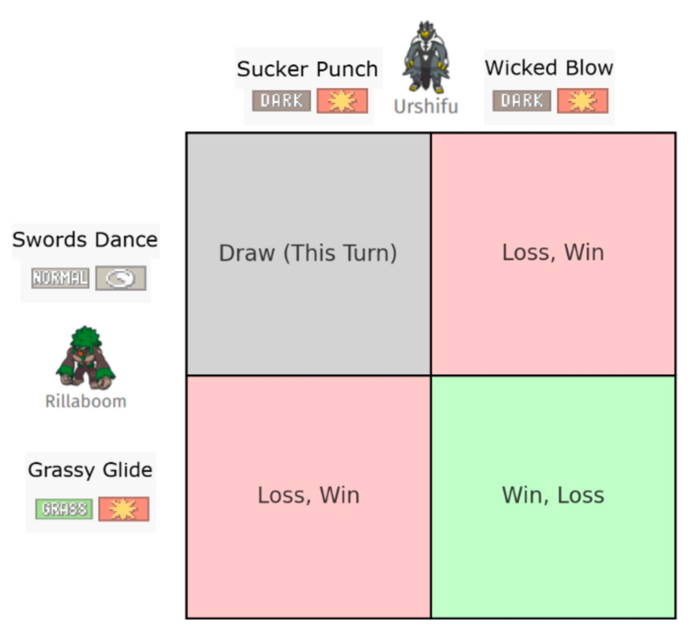
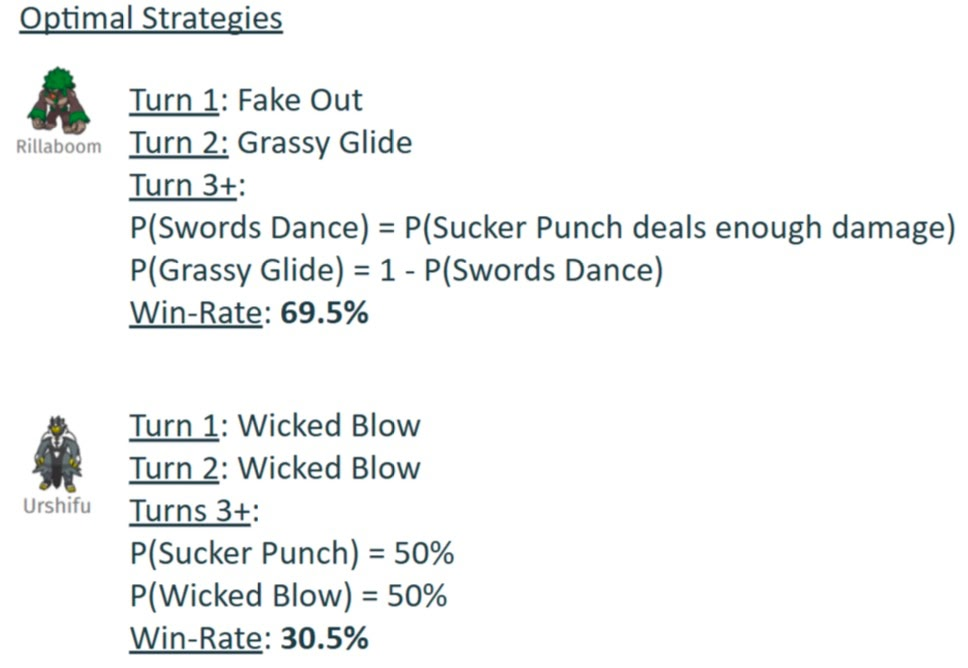
</div>

## An Interesting Convergence

Jake, our Pokémon expert (with over 5000 hours?!), predicted almost identical strategies to our mathematical model.

## Nash Equilibria in Team Selection

Some team matchups resulted in pure Nash equilibria with dominant strategies, while others required mixed strategies, creating a Rock-Paper-Scissors dynamic:

<div style="display: flex; gap: 1rem; justify-content: center; align-items: center; flex-wrap: wrap; margin: var(--spacing-medium) 0;">
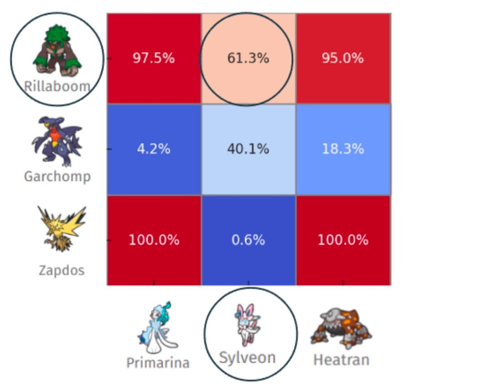
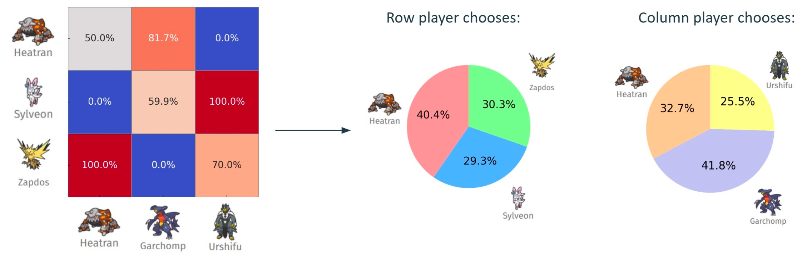
</div>

When our best team (Heatran, Sylveon, Zapdos) faced our worst team (Garchomp, Heatran, Urshifu), the best team only won 50.5% of the time.[^3]

[^3]: This is rock-paper-scissors at the team level. Just because Team A beats Team B and Team B beats Team C doesn't necessarily mean Team A beats Team C. This creates a complex competitive landscape where no single team dominates everything.

## Challenges & Limitations

Our biggest challenge was Pokémon's randomness. With 16 possible damage rolls per move and multi-turn battles, we needed tons of simulations rather than pure expectimax trees to get reliable win rates.[^1]

At first, Rillaboom was broken. It had no bad matchups (worst case: 50% win rate against itself). We added Zapdos and Garchomp to create actual counterplay.

One limitation was our decision to use fixed movesets. In competitive play, moveset variation is crucial for creating unpredictability and gaining an edge.[^2]

[^1]: Our final solution involved running over 1 million simulations for each matchup to accurately account for all possible random outcomes. This was computationally intensive but necessary to get statistically significant results.

[^2]: While we used the standard Smogon Strategy Dex movesets for consistency, competitive players often use surprise movesets to gain an edge.

## Conclusion & Future Work

We successfully found optimal Pokémon strategies using game theory.

The computational complexity explodes as we add Pokémon. With just 7 Pokémon, we evaluated 595 unique matchups. With 50 Pokémon, we'd need to analyze over 230,000 team combinations and millions of matchups. For n Pokémon, we'd need approximately O(n² + (n choose 3)²) matchups. Pokémon battles hit a sweet spot where optimal strategies exist but are hard to find due to the massive state space. That said, it's possible! (We might just have to rewrite our Python in Rust...)

Looking ahead, we'd like to expand to the top 50 Pokémon in the current meta. We'd need to account for unknown movesets and better handle the randomness. Eventually we want to tackle 6v6 with switching. That's 9 choices per turn instead of 4.

Our [paper](https://github.com/nicosalm/pokemon-expectimax/blob/main/report/CS839_FinalReport_PokemonBattles.pdf) and [code](https://github.com/nicosalm/pokemon-expectimax/tree/main) are available on GitHub if you'd like to explore our methods or build upon our work. Special thanks to Professor Manolis Vlatakis for being an encouraging mentor through this process! This project spawned out of his graduate class at UW-Madison: Game Theory, Optimization, and Learning (in Spring '25).
