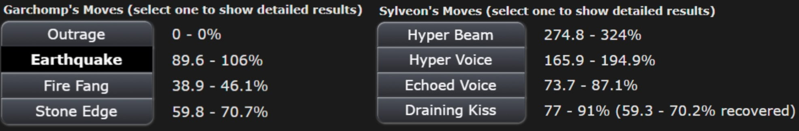

## Premise
In [Pokémon Showdown](https://pokemonshowdown.com/), you build a team of Pokémon and battle. In the 1v1 format, you bring three Pokémon and choose one for each battle. No switching allowed, so it's pure strategy. A game has two phases: choosing your Pokémon (left) and battling (right):

<div style="display: flex; justify-content: center; gap: 0.5rem;">
  
  
</div>

When a player's Pokemon's <abbr title="Hitpoints">HP</abbr> reaches 0, the other player wins:


## The Seven Pokemon We Analyzed
My friends and I focused on the seven most popular Pokémon from the January 2021 Showdown 1v1 leaderboard:


Each Pokémon's unique typing, movesets, and stats create diverse matchups. For consistency, we used each Pokémon's most popular moveset from [Smogon's Strategy Dex](https://www.smogon.com/dex/ss/pokemon/).

## Our Approach
Pokémon battles are [zero-sum games](https://en.wikipedia.org/wiki/Zero-sum_game): one player's win is the other's loss. Both players select moves simultaneously each turn — exactly the kind of interaction game theory was built to solve. Crucially, zero-sum games are among the few where we can efficiently compute Nash equilibria, unlike general games.

We modeled these battles in two key stages:

## The Battling Phase (Finding Optimal Move Strategies)

First, we analyzed how each matchup plays out when both players play optimally. We built turn-based payoff matrices for each matchup, calculating expected damage for every move combination with Showdown's [Damage Calculator](https://calc.pokemonshowdown.com/).

<figure style="margin: var(--spacing-medium) auto; text-align: center;">

<figcaption>Damage ranges between Garchomp and Sylveon's moves</figcaption>
</figure>

Pokémon battles have random elements: move accuracy, critical hits, and damage ranges. We handled these with [expectimax trees](https://inst.eecs.berkeley.edu/~cs188/textbook/games/expectimax.html) that calculate expected outcomes for each decision.

<figure style="margin: var(--spacing-medium) auto; text-align: center;">

<figcaption>Battle decision tree showing Hyper Beam outcomes between Primarina and Sylveon</figcaption>
</figure>


Some moves like *Sucker Punch* (which only works if the opponent uses an attacking move) create rock-paper-scissors mind games requiring [mixed strategy Nash equilibria](https://en.wikipedia.org/wiki/Strategy_(game_theory)#Mixed_strategy). When the payoff matrices got too complex, we turned to reinforcement learning to find strategies we'd never spot by hand.

<div style="clear: both;"></div>

### The Math Behind Nash Equilibrium

Because Pokémon battles are zero-sum, we can compute exact Nash equilibria efficiently with linear programming. The idea: maximize Player 1's guaranteed game value *v* subject to constraints on each player's move probabilities.

```python
def compute_nash_equilibrium(payoff_matrix):
    """
    payoff_matrix[i,j] = payoff when P1 plays i, P2 plays j
    Returns: (p1_strategy, p2_strategy, game_value)
    """
    num_rows, num_cols = payoff_matrix.shape

    # Maximize game value v, subject to:
    #   Expected payoff >= v against any P2 strategy
    #   Probabilities sum to 1, each in [0, 1]
    # ... LP constraint setup omitted for brevity ...

    res = linprog(c, A_ub=A_ub, b_ub=b_ub, A_eq=A_eq, b_eq=b_eq,
                  bounds=bounds, method='highs')

    p1_strategy = res.x[:-1]
    game_value = -res.fun
    return p1_strategy, p2_strategy, game_value
```

This gives us the optimal mixed strategy for each player. In the *Rillaboom vs. Urshifu* matchup, the math confirmed what top players already knew: Urshifu should mix *Sucker Punch* and *Wicked Blow* exactly 50/50 in late turns, while Rillaboom adapts between *Swords Dance* and *Grassy Glide* each turn.

## The Choosing Phase (Team Selection Strategies)

After solving each battle's optimal strategy, we turned to the team selection meta-game. After simulating over 1 million battles for each possible matchup, we built a payoff matrix of win probabilities:


From this matrix, we solved for the optimal team selection strategies.

### Analyzing Team Performance

We analyzed all 35 possible team combinations from our 7 Pokémon — 595 unique matchups total. Each matchup reuses the Nash solver from before:

```python
def analyze_matchup(team_a, team_b, win_probabilities):
    """Calculate team_a's win probability against team_b"""
    payoff_matrix = create_payoff_matrix(team_a, team_b, win_probabilities)
    _, _, game_value = compute_nash_equilibrium(payoff_matrix)
    return game_value
```

Then we pit every team against every other team and rank by average win rate:

```python
team_results = {}
for team in all_team_combinations:
    wins = [analyze_matchup(team, opp, win_probabilities)
            for opp in all_team_combinations if opp != team]
    team_results[team] = sum(wins) / len(wins)

best_teams = sorted(team_results.items(), key=lambda x: x[1], reverse=True)
```


## Key Findings

The strongest team was Heatran, Sylveon, and Zapdos, winning 62.4% of matchups on average. Garchomp, Heatran, and Urshifu together struggled at just 29.7%. Sylveon was the MVP, maintaining a 55.3% win rate across all team compositions.


Teams with Sylveon and Zapdos consistently won. Pairing Heatran with Urshifu was a recipe for disaster.

## Cool Matchup Examples

### Heatran vs. Garchomp


*Heatran vs. Garchomp* was one of the simpler matchups. Despite Garchomp's fearsome reputation, Heatran wins 81.7% of the time when both players play optimally. Heatran should open with *Will-O-Wisp* to burn and halve Garchomp's attack, then spam *Dragon Pulse*. Garchomp's best bet is *Stone Edge* despite its 80% accuracy.

<div style="clear: both;"></div>

### Rillaboom vs. Urshifu

*Rillaboom vs. Urshifu* is where the mind games get real. *Sucker Punch* only works against attacking moves, so neither Pokémon has a dominant strategy. The math says Urshifu should mix Sucker Punch and Wicked Blow 50/50 after turn 2, while Rillaboom adapts each turn. Even with perfect play from both sides, Rillaboom wins 69.5% of the time.

<div style="display: flex; gap: 1rem; justify-content: center; flex-wrap: wrap; margin: var(--spacing-medium) 0;">


</div>

## An Interesting Convergence

Jake, our Pokémon expert (with over 5000 hours?!), independently predicted nearly the same strategies as our model.

## Nash Equilibria in Team Selection

Some team matchups had pure Nash equilibria with dominant strategies, while others required mixed strategies, creating a Rock-Paper-Scissors dynamic:

<div style="display: flex; gap: 1rem; justify-content: center; align-items: center; flex-wrap: wrap; margin: var(--spacing-medium) 0;">


</div>

When our best team (Heatran, Sylveon, Zapdos) faced our worst team (Garchomp, Heatran, Urshifu), the best team only won 50.5% of the time.[^3]

[^3]: This is rock-paper-scissors at the team level. Just because Team A beats Team B and Team B beats Team C doesn't necessarily mean Team A beats Team C. So no single team dominates.

## Challenges & Limitations

Our biggest challenge was Pokémon's randomness. With 16 possible damage rolls per move and multi-turn battles, we needed tons of simulations rather than pure expectimax trees for reliable win rates.[^1]

At first, Rillaboom was broken. It had no bad matchups (worst case: 50% win rate against itself). We added Zapdos and Garchomp to create actual counterplay.

We also limited ourselves to fixed movesets. In competitive play, players vary movesets to stay unpredictable.[^2]

[^1]: We ultimately ran over 1 million simulations per matchup to account for all random outcomes — computationally intensive, but necessary for statistical significance.

[^2]: While we used the standard Smogon Strategy Dex movesets for consistency, competitive players often run surprise movesets to stay unpredictable.

## Conclusion & Future Work

We found optimal Pokémon strategies through game theory.

The computational complexity explodes as we add Pokémon. With just 7 Pokémon, we evaluated 595 unique matchups. With 50 Pokémon, we'd need to analyze over 230,000 team combinations and millions of matchups. For n Pokémon, we'd need approximately O(n² + (n choose 3)²) matchups. Pokémon battles hit a sweet spot where optimal strategies exist but are hard to find due to the massive state space. That said, it's possible! (We might just have to rewrite our Python in Rust...)

Next, we'd like to expand to the top 50 Pokémon in the current meta, handling unknown movesets and randomness better. Eventually we want to tackle 6v6 with switching. That's 9 choices per turn instead of 4.

Our [writeup](https://github.com/nicosalm/pokemon-expectimax/blob/main/report/CS839_FinalReport_PokemonBattles.pdf) and [code](https://github.com/nicosalm/pokemon-expectimax/tree/main) are available on GitHub if you'd like to explore or build on our work. Special thanks to Professor Manolis Vlatakis for mentoring us through this project! This project grew out of his graduate class at UW-Madison: Game Theory, Optimization, and Learning (in Spring '25).
